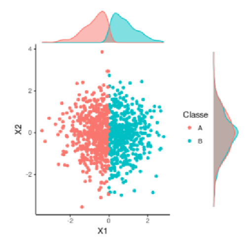
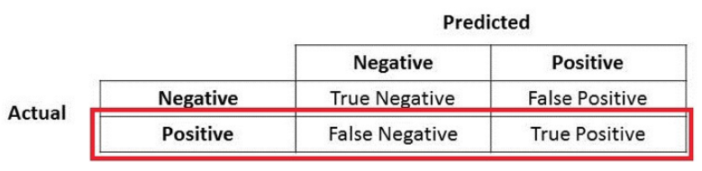
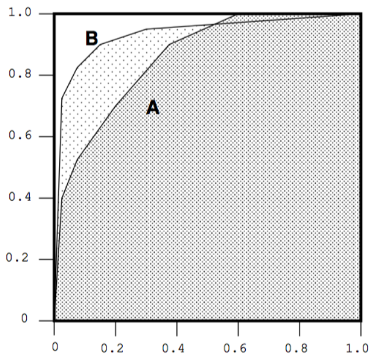

```{r setup, include=FALSE}
knitr::opts_chunk$set(echo = TRUE)
```

# Aprendizagem de Maquina: Funções de Custo, Reamostragem e Avaliação de Classificadores

## Aprendizado de Máquina na Prática

- Definição dos objetivos: trata-se do primeiro passo de qualquer
análise. Devemos saber onde queremos chegar!
- Coleta dos dados: envolve a coleta de material que o algoritmo
utilizará para “aprender”.
- Representação (feature engineering): Definir qual é a representação do problema que será usada.
- Exploração e preparação dos dados: É exigido um trabalho adicional na preparação desses. Nesse passo devemos lidar com dados faltantes, desbalanceados, ruídos, etc...
- Treinamento dos modelos: Definir e treinar os modelos.
- Avaliação dos modelos: Avaliamos a qualidade do aprendizado levando aspectos de sobre- e sub-aprendizado.
- Melhoria do modelo: Se necessário, podemos melhorar o desempenho do modelo através de estratégias mais avançadas, como por exemplo, ensembles, seleção dinâmica de classificadores, etc.


## Problemas com os dados

- Dados faltantes
- Dados desbalanceados
- Variáveis correlacionadas

### Dados Faltantes

- Em alguns casos alguns atributos da representação definida
inicialmente podem estar faltando (missing features).
- Nesses casos o pré-processamento mais comum é a imputação de
dados

{width=50%}

MEXER APENAS NA BASE DE TREINO, NÃO NA DE TESTE

### Dados Desbalanceados

- Em alguns problemas, o desbalanceamento é algo intrínseco ao
problema.
  - Em aplicações médicas isso é bastante comum.
- Algumas técnicas propostas na literatura tentam mitigar esse
problema, gerando dados sintéticos
  - SMOTE (Synthetic Minority Over-sampling Technique)
  - Use com parcimônia. Dados sintéticos podem não fazer sentido em
alguns casos.
- Alguns algoritmos lidam melhores com dados desbalanceados, por
exemplo, árvores de decisão.
- Existem também alguns algoritmos modificados para lidar com dados
desbanceados
  - Penalized-SVM, penalized-LDA, Adaptive Random Forest.
- Algumas outras alternativas:
  - Decompor a classe majoritária em sub-classes.


### Variáveis correlacionadas

- Em alguns casos algumas variáveis não carregam nenhum poder de
discriminação.

{width=25%}


- Entretanto se a fronteira de decisão fosse diferente, ambas variáveis
seriam necessárias para discriminar as duas classes
- Ou seja, a noção de relevância está diretamente com o objetivo a ser
perseguido.

{width=25%}

### Garbage in, Garbage out

{width=50%}

## Avaliando desempenho

- Na aprendizagem supervisionada (classificação), a matriz de confusão
permite a visualização dos erros e acertos do classificador.
- Matriz quadrada de tamanho n × n em que n é o número de classes.


{width=60%}


### Acurácia: 

- Razão entre as predições corretas pelo total
- Só é util como metrica numa base balanceada (mesma quantidade em diferentes desfechos)
 
{width=75%}

### Precisão (P)

- É o número de verdadeiros positivos (TP) divido pelo
número de positivos estimados pelo modelo.
- Tende a 1 se FP tende a 0

$$
p = \frac{TP}{TP+FP}
$$

- Informa o quão preciso é o modelo. Uma boa medida para ser
utilizada quando o custo de FP é alto.

{width=50%}

### Recall (R)

- É o número de verdadeiros positivos (TP) divido pela soma
de TP + FN
- Tende a 1 se FN tende a 0

$$
R = \frac{TP}{TP+FN}
$$

{width=50%}

### F1Score

- F1Score: é um compromisso entre Precisão e Recall através de uma média
harmônica.
$$
F_1 Score = 2 × \frac{P × R}{P + R}
$$

- Porque não usar a média aritmética simples?
  - Exemplos

{width=90%}


### Espaço ROC

- ROC (Receiver Operating Characteristic) é uma representação gráfica que
ilustra o desempenho de um classificador binário em um determinado ponto
de operação.
- Classificadores do exemplo anterior no espaço ROC.

{width=40%}


  - B (50% de acerto) - é jogar um moeda
  
- A curva ROC mostra todos os pontos de operação do classificador
(relação entre TP e FP)
- Para cada ponto, existe um limiar associado.
- EER (Equal Error Rate): Ponto no gráfico no qual FPR é igual a
1-TPR
- Quando não existe um ponto operacional específico, usamos EER.

{width=50%}


Simulador: <https://kennis-research.shinyapps.io/ROC-Curves>


#### Exemplo

- Considere 20 amostras, 10 classificadas corretamente (+) e 10
classificadas incorretamente (-) com suas respectivas probabilidades.

{width=75%}

- Após ordenar os dados usando as probabilidades, temos a seguinte
curva ROC

{width=50%}

- Suponha que a especificação do seu sistema diga que o máximo FPR permitido
é de 10%
- Qual seria o ponto de operação do sistema (limiar)?
- Para esse limiar (0.54), temos 14 exemplos classificados corretamente, ou seja 70%

{width=50%}

#### Classes desbalanceadas

- Curvas ROC têm um propriedade interessante: não são sensíveis a
mudanças de distribuição das classes
- Se a proporção de instancias negativas e positivas na base de teste
muda, a curva continua a mesma.
- Entretanto para problemas altamente desbalanceados a curva ROC
pode levar a conclusões erradas.
- Nesses casos é mais interessante analisar a curva “Precision Recall”

{width=80%}

- A razão para isso é que em geral não estamos muito preocupados em como o classificador se comporta com relação a classe majoritária, e sim como ele se comporta com relação a classe minoritária.
- Nesses casos, F Measure e a Área sob a curva “Precision Recall” são métricas mais relevantes.
- Considere por exemplo um problema de classificação com uma proporção de 100:1 (exemplos em anexo com classe 0=985 e classe 1=15 (ROC e Precision x Recall).


{width=80%}


### Função Custo

Em problemas de regressão a função custo mais utilizada é a soma dos
erros quadrados (MSE- Mean Squared Error)
$$
MSE = \frac{1}{n}\sum_{i=1}^{n}(Y_i - \hat{Y_i} )²
$$
em que Yi é o valor real e ˆYi o valor estimado pelo

{width=80%}

Exemplo
Suponha que estamos interessados em estudar a relação entre X e Y
Como definir qual é a melhor predição?
▶ Aquela que minimizar a função de custo.

{width=40%}

Flexibilidade do Modelo
Entretanto, a minimização do custo na base de treinamento pode
levar a modelos com pouca flexibilidade, ou seja, over-fitting.
Modelos muito simples por outro lado, onde o custo não é
minimizado, levam ao under-fitting

{width=75%}

Validação
A utilização de uma base de validação para monitorar o desempenho
do modelo de aprendizagem de máquina é uma das técnicas mais
utilizadas de regularização.
Também conhecida como Early stopping

{width=75%}
Dividindo os dados

{width=75%}


[IMAGEM]

[...]


## tECNICAS DE Validação

### Holdout

- Dados são divididos em duas partes: treinamento e teste.
- A base de treinamento é então dividida em validação e treinamento.
- O erro resultante dos dados de validação fornece uma estimativa do
erro do teste.
- Resultado pode ser dependente da divisão dos dados


{width=50%}

### Validação k-Fold
O método consiste em dividir os dados de treinamento em k partes
iguais.
O treinamento é realizado com k − 1 partes.
A parte não utilizada no treinamento é utilizada para validação do
modelo.
O processo é repetido k vezes
O erro médio é uma estimativa do erro do teste.

{width=75%}

Validação Leave One Out

- Igual ao processo k-fold, em k = número de exemplos na base de aprendizagem.
- Indicado para pequenas bases de dados.

{width=75%}


Comparando Classificadores

Qual seria o melhor classificador?

{width=40%}


### AUC (Area Under de Curve)

{width=50%}


[...]

# Aprendizagem de Máquina: Aprendizagem baseada em Instâncias


[...]

# Exercicio identificação de números


```{bach eval=FALSE, include=FALSE}
hrsdespindula@h8:~$ cd DSBD/
hrsdespindula@h8:~/DSBD$ LS
LS: command not found
hrsdespindula@h8:~/DSBD$ ls
00-Anotacoes_gerais            06-Modelos_Estatisticos
01-Metodologia_de_Pesquisa     99-Outros
02-Linguagem_de_Programacao    DSBD.Rproj
03-Infrestutura_Computacional  Lista_de_Exercicios01.ipynb
04-Inferencia_Estatistica      TCC
05-Aprendizagem_de_Maquina
hrsdespindula@h8:~/DSBD$ cd 05-Aprendizagem_de_Maquina/
hrsdespindula@h8:~/DSBD/05-Aprendizagem_de_Maquina$ cd lab01/
hrsdespindula@h8:~/DSBD/05-Aprendizagem_de_Maquina/lab01$ ls
digits  digits.py  knn.py  samples.png
hrsdespindula@h8:~/DSBD/05-Aprendizagem_de_Maquina/lab01$ 

hrsdespindula@h8:~/DSBD/05-Aprendizagem_de_Maquina/lab01$ chmod +x digits.py

hrsdespindula@h8:~/DSBD/05-Aprendizagem_de_Maquina/lab01$ python3 digits.py features.txt  5 5
Traceback (most recent call last):
  File "/home/espinf/hrsdespindula/DSBD/05-Aprendizagem_de_Maquina/lab01/digits.py", line 7, in <module>
    import cv2
ModuleNotFoundError: No module named 'cv2'

hrsdespindula@h8:~/DSBD/05-Aprendizagem_de_Maquina/lab01$ pip install --upgrade pip
Requirement already satisfied: pip in /usr/lib/python3/dist-packages (20.3.4)
Collecting pip
  Downloading pip-24.2-py3-none-any.whl (1.8 MB)
     |████████████████████████████████| 1.8 MB 4.9 MB/s 
Installing collected packages: pip
  WARNING: The scripts pip, pip3 and pip3.9 are installed in '/home/espinf/hrsdespindula/.local/bin' which is not on PATH.
  Consider adding this directory to PATH or, if you prefer to suppress this warning, use --no-warn-script-location.
Successfully installed pip-24.2


hrsdespindula@h8:~/DSBD/05-Aprendizagem_de_Maquina/lab01$ pip install opencv-python
Defaulting to user installation because normal site-packages is not writeable
Collecting opencv-python
  Downloading opencv_python-4.10.0.84-cp37-abi3-manylinux_2_17_x86_64.manylinux2014_x86_64.whl.metadata (20 kB)
Requirement already satisfied: numpy>=1.17.0 in /usr/lib/python3/dist-packages (from opencv-python) (1.19.5)
Downloading opencv_python-4.10.0.84-cp37-abi3-manylinux_2_17_x86_64.manylinux2014_x86_64.whl (62.5 MB)
   ━━━━━━━━━━━━━━━━━━━━━━━━━━━━━━━━━━━━━━━━ 62.5/62.5 MB 51.1 MB/s eta 0:00:00
Installing collected packages: opencv-python
Successfully installed opencv-python-4.10.0.84


hrsdespindula@h8:~/DSBD/05-Aprendizagem_de_Maquina/lab01$ python3 digits.py features.txt  5 5
5 5
Loading images...
Extracting dummy features
Done!
hrsdespindula@h8:~/DSBD/05-Aprendizagem_de_Maquina/lab01$ 
  
hrsdespindula@h8:~/DSBD/05-Aprendizagem_de_Maquina/lab01$ head features.txt 
0 0 0 0 1 0 0 0 1 0 1 0 0 0 0 1 1 0 0 1 0 1 1 1 0 0 
0 0 0 0 1 1 0 1 1 0 1 0 1 0 0 1 1 0 0 1 0 1 1 1 0 0 
0 0 0 1 1 1 0 1 0 0 1 0 1 0 0 1 1 0 0 1 0 1 1 1 0 0 
0 0 0 0 1 1 0 1 1 0 1 0 1 0 0 0 1 0 1 0 0 1 1 0 0 0 
0 0 0 1 1 0 0 1 1 1 1 1 1 0 0 1 1 0 1 1 1 0 1 1 1 0 
0 0 0 0 1 1 0 1 1 0 1 1 1 0 0 1 1 0 0 1 0 1 1 1 0 0 
0 0 1 1 0 0 1 0 0 1 0 1 0 0 0 1 1 0 0 0 1 0 1 1 1 0 
0 0 1 1 1 0 0 1 0 0 1 1 0 0 0 1 1 0 0 1 1 0 1 1 1 0 
0 0 0 0 1 1 0 1 1 1 1 1 1 0 0 1 1 0 0 1 1 1 1 1 0 0 
0 0 1 1 1 0 1 1 0 0 1 0 1 0 0 1 1 0 0 1 1 0 1 1 0 0 


hrsdespindula@h8:~/DSBD/05-Aprendizagem_de_Maquina/lab01$ tail features.txt 
9 0 1 1 1 1 1 1 1 1 1 0 0 0 1 0 0 0 1 0 0 0 1 0 0 0 
9 0 1 1 1 0 1 1 1 1 1 0 0 0 1 0 0 0 1 0 0 0 0 1 0 0 
9 0 1 1 1 0 1 0 0 0 1 1 1 1 1 0 0 1 1 0 0 1 1 0 0 0 
9 0 1 1 1 0 1 0 0 0 1 1 1 1 1 0 0 0 0 1 0 0 0 0 1 0 
9 0 1 1 0 1 1 0 0 1 0 0 0 1 0 0 0 0 1 0 0 0 0 1 0 0 
9 0 0 1 1 1 0 1 0 0 1 1 1 1 1 1 0 0 0 1 0 0 0 0 1 0 
9 0 1 1 1 1 1 0 0 1 1 0 0 0 1 0 0 0 0 1 0 0 0 0 0 0 
9 0 1 1 0 1 1 0 0 0 1 0 0 1 0 0 0 0 0 0 0 0 1 0 0 0 
9 0 0 1 1 1 1 0 0 0 1 1 1 0 1 0 0 0 1 1 0 0 0 1 0 0 
9 0 1 1 1 1 1 0 0 0 1 0 0 0 1 0 0 0 1 0 0 0 0 1 0 0 

hrsdespindula@h8:~/DSBD/05-Aprendizagem_de_Maquina/lab01$ chmod +x knn.py 

hrsdespindula@h8:~/DSBD/05-Aprendizagem_de_Maquina/lab01$ python3 knn.py features.txt 
Loading data...
Spliting data...
Fitting knn
Predicting...
Accuracy:  0.789
[[90  4  0  2  0  1  0  0  0  0]
 [ 0 92  0  0  0  0  1  0  2  0]
 [ 4 11 72  8  0  3  2  3  5  3]
 [ 2  0  2 90  0  5  1  1  1  1]
 [ 1  9  1  0 79  1  0  1  0  3]
 [ 4  4  0  9  0 78  1  0  1  0]
 [ 1  2  1  0  2  2 98  0  0  0]
 [ 0  6  0  1  5  0  0 74  0 11]
 [ 0  7  2  6  4 10  0 10 47  1]
 [ 0  4  1  1  4  0  0 33  0 69]]
              precision    recall  f1-score   support

         0.0       0.88      0.93      0.90        97
         1.0       0.66      0.97      0.79        95
         2.0       0.91      0.65      0.76       111
         3.0       0.77      0.87      0.82       103
         4.0       0.84      0.83      0.84        95
         5.0       0.78      0.80      0.79        97
         6.0       0.95      0.92      0.94       106
         7.0       0.61      0.76      0.68        97
         8.0       0.84      0.54      0.66        87
         9.0       0.78      0.62      0.69       112

    accuracy                           0.79      1000
   macro avg       0.80      0.79      0.79      1000
weighted avg       0.80      0.79      0.79      1000

hrsdespindula@h8:~/DSBD/05-Aprendizagem_de_Maquina/lab01$ chmod +x shell.sh 

hrsdespindula@h8:~/DSBD/05-Aprendizagem_de_Maquina/lab01$ ./shell.sh 


```


