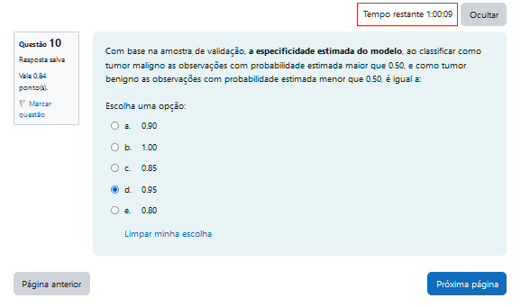
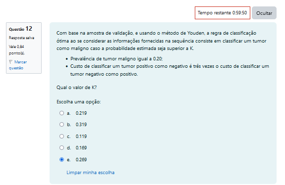

```{r setup, include=TRUE}
knitr::opts_chunk$set(echo = TRUE)

require("ISLR")
require("ggplot2")
require("GGally")
require("leaps") ## seleção de variaveis
require("car")
require(tidyverse)
require(caret)
require(MASS)
require(labeling)
require(faraway)
require(pscl)
require(pROC)

```

# Ajuste modelo Geral

```{r}
#Carseats
data("wbca") 
#help("wbca")

head(wbca, 10) ### Visualizando as dez primeiras linhas
str(wbca)
dim(wbca) ### Acessando a dimensão da base
summary(wbca) ### Resumo das variáveis

# Redefinir o nível de referência da variável Class (1 = maligno, 0 = benigno)
wbca$Class <- factor(wbca$Class, levels = c('1', '0'))

# Dividir a base de dados em base de ajuste (500 primeiras linhas) e base de validação (resto)
base_ajuste <- wbca[1:500, ]
base_validacao <- wbca[501:681, ]


# Ajustar o modelo de regressão logística
modelo_logistico <- glm(Class ~ Adhes + BNucl + Thick, data = base_ajuste, family = binomial)

# Ver o resumo do modelo ajustado
summary(modelo_logistico)


# Instalar pacote para métricas de ajuste, se necessário -> install.packages("pscl")
# Obter o pseudo-R^2 de McFadden
pR2(modelo_logistico)


# Fazer previsões na base de validação
previsoes <- predict(modelo_logistico, newdata = base_validacao, type = "response")

# Classificar como maligno (1) ou benigno (0) com um limiar de 0.5
previsao_class <- ifelse(previsoes > 0.5, '1', '0')

# Comparar com a variável Class na base de validação
tabela_confusao <- table(previsao_class, base_validacao$Class)

# Ver a matriz de confusão
print(tabela_confusao)


```

# QUIZ 

## Perguta 9 - ERRO

Com base na amostra de validação, a sensibilidade estimada do modelo, ao classificar como tumor maligno as observações com probabilidade estimada maior que 0.50, e como tumor benigno as observações com probabilidade estimada menor que 0.50, é igual a:

{width=50%}


### Metodo 1

```{r}
predicoes <- predict(modelo_logistico, newdata = base_validacao, type = 'response')

tab_pred <- table(ifelse(predicoes < 0.5, 'Pred_No', 'Pred_Yes'), base_validacao$Class)
tab_pred

# Cálculo da acurácia
TP <- tab_pred["Pred_Yes",'1']    # Verdadeiros Positivos
TN <- tab_pred["Pred_No", '0']      # Verdadeiros Negativos
FP <- tab_pred["Pred_Yes", '0']      # Falsos Positivos
FN <- tab_pred["Pred_No", '1']      # Falsos Negativos
total <- sum(tab_pred)                # Total de observações

# Acurácia
acuracia <- (TP + TN) / total
acuracia

sensibilidade <- (TP)/(TP + FN)
sensibilidade

especificidade <- (TN)/(TN + FP)
especificidade
```


### Metodo 2

```{r}
# Ajustar o modelo de regressão logística com base na amostra de ajuste
modelo_logistico <- glm(Class ~ Adhes + BNucl + Thick, data = base_ajuste, family = binomial)

# Prever probabilidades para a amostra de validação
#prob_validacao <- predict(modelo_logistico, newdata = base_validacao, type = "response")
#print(prob_validacao)

# Classificar com base na probabilidade de corte 0.50
#predicoes <- ifelse(prob_validacao >= 0.50, "1", "0")

# Criar uma matriz de confusão
tabela_confusao2 <- table(Predito = previsao_class, Real = base_validacao$Class)
#print(tabela_confusao)
print(tabela_confusao2)

# Calcular a sensibilidade
verdadeiros_positivos <- tabela_confusao2["1", "1"]
falsos_negativos <- tabela_confusao2["0", "1"]
sensibilidade <- verdadeiros_positivos / (verdadeiros_positivos + falsos_negativos)

# Exibir a sensibilidade
sensibilidade

```
### Metodo 3

```{r}
# Supondo que o modelo foi ajustado e as predições foram feitas
# Prever as probabilidades para a amostra de validação
prob_validacao <- predict(modelo_logistico, newdata = base_validacao, type = "response")

# Classificar com base na probabilidade de corte 0.50
predicoes <- ifelse(prob_validacao > 0.50, "1", "0")

# Criar uma matriz de confusão
tabela_confusao <- table(Predito = predicoes, Real = base_validacao$Class)

# Calcular a sensibilidade
verdadeiros_positivos <- tabela_confusao["1", "1"]
falsos_negativos <- tabela_confusao["0", "1"]

# Se não houver verdadeiros positivos, a sensibilidade será 0
if (is.na(verdadeiros_positivos) || (verdadeiros_positivos + falsos_negativos) == 0) {
  sensibilidade <- 0
} else {
  sensibilidade <- verdadeiros_positivos / (verdadeiros_positivos + falsos_negativos)
}

# Exibir a sensibilidade
sensibilidade

```


### Metodo 4

```{r}
# Carregar o pacote necessário
library(faraway)

# Redefinir a variável Class para modelar a probabilidade de tumor maligno
wbca$Class <- factor(wbca$Class, levels = c('1', '0'))

# Dividir os dados em amostra de ajuste e amostra de validação
ajuste <- wbca[1:500, ]
validacao <- wbca[501:681, ]

# Ajustar o modelo de regressão logística com base na amostra de ajuste
modelo_logistico <- glm(Class ~ Adhes + BNucl + Thick, data = ajuste, family = binomial)

# Prever probabilidades para a amostra de validação
prob_validacao <- predict(modelo_logistico, newdata = base_validacao, type = "response")

# Classificar com base na probabilidade de corte 0.50
predicoes <- ifelse(prob_validacao > 0.50, "1", "0")

# Criar uma matriz de confusão
tabela_confusao <- table(Predito = predicoes, Real = validacao$Class)

# Exibir a matriz de confusão
print(tabela_confusao)

# Calcular a sensibilidade
verdadeiros_positivos <- tabela_confusao["1", "1"]
falsos_negativos <- tabela_confusao["0", "1"]
sensibilidade <- verdadeiros_positivos / (verdadeiros_positivos + falsos_negativos)

# Exibir a sensibilidade
sensibilidade

```


## Perguta 10 - ERRO

Com base na amostra de validação, a especificidade estimada do modelo, ao classificar como tumor maligno as observações com probabilidade estimada maior que 0.50, e como tumor benigno as observações com probabilidade estimada menor que 0.50, é igual a:

{width=50%}

```{r}
# Criar a matriz de confusão (caso ainda não tenha feito)
tabela_confusao <- table(Predito = predicoes, Real = validacao$Class)

# Exibir a matriz de confusão
print(tabela_confusao)

# Calcular a especificidade
verdadeiros_negativos <- tabela_confusao["0", "0"]  # Tumores benignos corretamente classificados
falsos_positivos <- tabela_confusao["1", "0"]       # Tumores benignos que foram classificados como malignos
especificidade <- verdadeiros_negativos / (verdadeiros_negativos + falsos_positivos)

# Exibir a especificidade
especificidade

```


## Perguta 12

Com base na amostra de validação, e usando o método de Youden, a regra de classificação ótima ao se considerar as informações fornecidas na sequência consiste em classificar um tumor como maligno caso a probabilidade estimada seja superior a K.

- Prevalência de tumor maligno igual a 0.20;
- Custo de classificar um tumor positivo como negativo é três vezes o custo de classificar um tumor negativo como positivo.

Qual o valor de K?

{width=50%}

```{r}
# Suponha que você tenha a matriz de confusão com base em um modelo existente
# A prevalência é 0.20
prevalencia <- 0.20
custo_positivo <- 3
custo_negativo <- 1

# Cálculo do custo total para cada ponto de corte possível
pontos_de_corte <- seq(0, 1, by = 0.01)
custos_totais <- numeric(length(pontos_de_corte))

for (i in seq_along(pontos_de_corte)) {
  k <- pontos_de_corte[i]
  
  # Calcule as previsões de acordo com o ponto de corte
  predicoes <- ifelse(prob_validacao > k, "1", "0")
  
  # Crie a matriz de confusão
  tabela_confusao <- table(Predito = predicoes, Real = validacao$Class)
  
  # Calcule a sensibilidade e a especificidade
  if ("1" %in% rownames(tabela_confusao) && "0" %in% rownames(tabela_confusao)) {
    verdadeiros_positivos <- tabela_confusao["1", "1"]
    falsos_negativos <- tabela_confusao["0", "1"]
    verdadeiros_negativos <- tabela_confusao["0", "0"]
    falsos_positivos <- tabela_confusao["1", "0"]

    sensibilidade <- verdadeiros_positivos / (verdadeiros_positivos + falsos_negativos)
    especificidade <- verdadeiros_negativos / (verdadeiros_negativos + falsos_positivos)
  } else {
    sensibilidade <- 0
    especificidade <- 0
  }
  
  # Calcule o custo total para o ponto de corte
  custo_total <- custo_positivo * (falsos_negativos / (falsos_negativos + verdadeiros_positivos)) +
                 custo_negativo * (falsos_positivos / (falsos_positivos + verdadeiros_negativos))
  custos_totais[i] <- custo_total
}

# Encontre o ponto de corte que minimiza o custo total
indice_otimo <- which.min(custos_totais)
k_otimo <- pontos_de_corte[indice_otimo]

# Exibir o valor de K
print(k_otimo)


```

```{r}
# Supondo que r1 é um objeto de curva ROC criado anteriormente, e 'validacao$Class' e 'prob_validacao' são os dados de validação e as probabilidades estimadas
# Exemplo de ajuste do modelo e cálculo da curva ROC

best_coords_equal_cost <- coords(roc_curve, x = "best", best.method = "youden")
print(best_coords_equal_cost)

# Custos do falso negativo são 3 vezes o do falso positivo

r2 <- roc(validacao$Class, prob_validacao)

# Encontrar as coordenadas para a classificação ótima usando o método de Youden
best_coords_equal_cost <- coords(r2, x = "best", best.method = "youden", best.weights = c(1, (1/3)))
print(best_coords_equal_cost)
# Custos do falso negativo são 3 vezes o do falso positivo

# Cálculo dos escores de crédito
cred_escores <- 100 * (1 - prob_validacao)  # Assumindo que prob_validacao contém as probabilidades de um evento (ex: pagar)
head(cred_escores, 20)  # Exibir os primeiros 20 escores de crédito

# Histograma dos escores de crédito
hist(cred_escores, main = 'Distribuição dos Escores de Crédito', xlab = 'Escore de Crédito', ylab = 'Frequência', col = 'lightblue')

```


