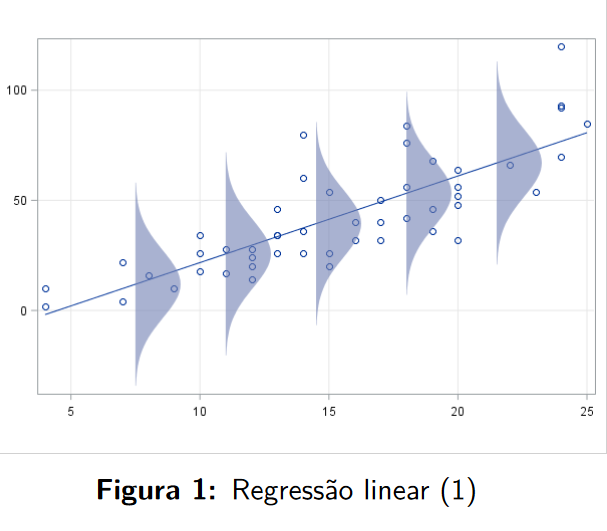

```{r setup, include=FALSE}
knitr::opts_chunk$set(echo = TRUE)

```

# Regressão Linear

```{r}
### Modelos estatísticos - Aula de modelos lineares
### Pacotes usados na aula.
require("ISLR")
require("ggplot2")
require("GGally")
require("leaps") ## seleção de variaveis
require("car")

options(device = X11)
```

## Recomendações de leitura

[...]

## Objetivo
Num modelo de regressão linear, a relação entre uma variável aleatória de interesse (variável resposta) e um conjunto de preditores (variáveis explicativas) é definida por uma função linear envolvendo os preditores e um conjunto de parâmetros associados (coeficientes ou $\beta $′s ou parametros).

## "Composição"
- Variaveis Resposta
- Variaveis Explicativas

Exemplo:

- Aplicação 1: Preço de Imóveis
  - Variável Resposta: Preço do imóvel
  - Variáveis Explicativas: Tamanho do imóvel (m2), número de quartos, localização (bairro), idade do imóvel, presença de garagem

- Aplicação 2: Desempenho Escolar
  - Variável Resposta: Nota final em uma disciplina
  - Variáveis Explicativas: Número de horas estudadas por semana, frequência nas aulas, nota em provas anteriores, participação em atividades extraclasse, apoio familar

- Aplicação 3: Vendas de um produto
  - Variável Resposta: Vendas mensais de um produto
  - Variáveis Explicativas: Preço do produto, gastos em marketing, número de vendedores, promoções realizadas, condições econômicas.

- Aplicação 4: Consumo de Energia
  - Variável Resposta: Consumo de energia elétrica (kWh)
  - Variáveis Explicativas: Tamanho da residência (m2), número de moradores, uso de eletrodomésticos, temperatura média na região, tipo de aquecimento

- Aplicação 5: Rendimento de Investimentos
  - Variável Resposta: Rendimento de uma carteira de investimentos
  - Variáveis Explicativas: Taxa de juros, porcentagem de ações vs. renda fixa, valor inicial investido, taxa de inflação, duração do investimento


## Modelo de regressão linear


Seja $y$ a variável resposta e $x1, x2, ..., xk$ os $k$ preditores. O modelo de regressão linear fica definido por:
$$
y = \beta_0 + \beta_1 x_1 + \beta_2 x_2 + ... + \beta_k x_k + \epsilon
$$

onde:

- $\beta_0$ é o intercepto do modelo (se todos os $x$s e $\epsilon$ forem 0 $ y = \beta_0$ );
- $\beta_1, \beta_2, ... \beta_k$ são parâmetroa do modelo,  que correspondem aos efeitos lineares de cada um dos $k$ preditores;
- $\epsilon$ representa os erros aleatórios, específicos para cada indivíduo. É a parte de $y$ que não é explicada pela regressão linear.

### Erros

Embora sejam não observáveis e não explicados pelo modelo, na regressão linear assumimos as seguintes propriedades para os erros:

 - Os erros têm média zero;
 - Os erros têm variância constante;
 - Os erros para dois indivíduos quaisquer são não correlacionados;
 - Os erros têm distribuição normal.
 
Este conjunto de suposições é usualmente denotado por $\epsilon \sim N (0, \sigma^2)$.


#### Regressão Linear Simples

Como caso particular da regressão linear temos a regressão linear simples, que se caracteriza por considerar um único preditor:

$$
y = \beta_0 + \beta_1 x + \epsilon,
\space \space \space \space \space 
\epsilon \sim N (0, \sigma^2)
$$

#### Regressão Linear Polinomial

Outro modelo de regressão linear bastante usual é o modelo de regressão polinomial, que permite explicar uma relação não linear entre a resposta e o(s) preditor(es):

$$
y = \beta_0 + \beta_1 x + \beta_2 x^2 + ... + \beta_k x^k + \epsilon,
\space \space \space \space \space 
\epsilon \sim N (0, \sigma^2)
$$
{width=50%}

{width=50%}

{width=50%}

{width=50%}

{width=50%}

{width=50%}


## Um breve histórico

- Século 19: Desenvolvimento da teoria de mínimos quadrados, que serve de base para o ajuste de modelos de regressão.
- A teoria de mínimos quadrados teve origem na Física motivada, dentre outros, por problemas na área navegação (século 18).
- Ao longo do século 19, modelos lineares e o método de mínimos quadrados passaram a ser utilizados em outras ciências, baseados em modelos pré-estabelecidos, ou apenas em evidências empíricas.
- O termo regressão foi introduzido por Francis Galton em 1875, baseado no princípio da
“regressão à média”.

## Regressão linear

- Os dois objetivos principais de uma análise de regressão são os seguintes:
  - Exploratório- Analisar a relação funcional entre uma variável aleatória (resposta) e um conjunto de variáveis preditoras.
  - Preditivo- Predizer valores não observados da variável resposta para valores especificados das variáveis preditoras.


## Exemplo- Consumo de combustível

- Neste exemplo vamos analisar os dados da base Auto, disponíveis na biblioteca ISLR do R.
- A base de dados dispõe de informações técnicas de 392 modelos de automóveis das décadas de 1970 e 1980, como consumo de combustível. potência do motor, dimensões dentre outras.
- O objetivo aqui é ajustar modelos de regressão linear que expliquem o consumo de combustível com base em características do modelo.
- Neste primeiro momento, para fins ilustrativos vamos considerar apenas duas variáveis de cada vez, embora o mais usual seja considerar múltiplas variáveis conjuntamente numa
análise de regressão.

```{r}

```


```{r eval=TRUE, include=TRUE}
summary(Auto)

ggplot(Auto, aes(x = year)) + geom_histogram()

ggplot(Auto, aes(x = year, y = mpg)) + geom_point() +
    stat_smooth(method = "lm") +
    theme_bw(base_size = 14)

```


```{r eval=TRUE, include=TRUE}

plot1 <- ggplot(Auto, aes(x = horsepower, y = mpg)) + geom_point() + theme_bw(base_size = 14)
plot1


plot1 + coord_trans(x="log2", y="log2")
```


{width=50%}

- Inicialmente, vamos ajustar um modelo de regressão linear que permita explicar o consumo de combustível (mpg- variável resposta) em função do ano de lançamento do modelo (yearvariável
explicativa).
- A Figura 7 sugere relação linear crescente entre o consumo de combustível e o ano de lançamento do modelo.
- O modelo de regressão linear para esse par de variáveis fica especificado por:
$$
mpg = \beta_0 + \beta_1 \times year + \epsilon,
$$
onde $\beta_0$ e $\beta_1$ são os parâmetros do modelo (intercepto e inclinação da reta de regressão) e $\epsilon$ representa os erros aleatórios.


- O ajuste da regressão linear consiste na estimação dos parâmetros do modelo (β0 e β1), com base nos dados amostrais, que produzem a reta de regressão que melhor se ajusta aos
dados.
- O método usual de estimação dos parâmetros de uma regressão linear é o método de mínimos quadrados, que será estudado adiante.
- Aplicando o método de mínimos quadrados, obtemos os parâmetros estimados $\hat{\beta_0} = −70.01$ e $\hat{\beta_1} = 1.23$, produzindo a seguinte reta de regressão ajustada:
$$
\hat{mpg} = −70.01 + 1.23 \times year
$$

{width=50%}

{width=50%}

[continua....]


## Exemplo prático- Taxa de formados

- Na parte prática desta aula vamos analisar dados sobre a taxa de formados em $n=777$ universidades norte-americanas no ano de 1995.
- O objetivo é ajustar um modelo de regressão linear que permita explicar a taxa de alunos formados em função das características das universidades e de seus alunos.
- Uma breve descrição das variáveis explicativas é apresentada na sequência.

### Variaveis

- `Grad.Rate`: Taxa de alunos formados (resposta);
- `Apps`: Número de alunos inscritos;
- `Accept`: Número de alunos aceitos;
- `Enroll`: Número de novos alunos matriculados;
- `Top10perc`: Percentual de novos estudantes entre os 10% melhores no ensino médio;
- `Top25perc`: Percentual de novos estudantes entre os 25% melhores no ensino médio;
- `F.Undergrad`: Número de alunos em período integral nos cursos de graduação;
- `P.Undergrad`: Número de alunos em período parcial nos cursos de graduação;
- `Outstate`: Número de alunos bolsistas de outros estados;
- `Room.Board`: Gastos de hospedagem e alimentação;
- `Books`: Gastos com materiais bibliográficos;
- `Personal`: Gastos com recursos humanos;
- `PhD`: Percentual de professores com doutorado;
- `Terminal`: Percentual de professores com grau terminal;
- `S.F.Ratio`: Razão alunos/professor;
- `perc.alumni`: Percentual de ex-alunos que contribuem com donativos;
- `Expend`: Gasto educacional por aluno.
- Privada ou publica


## CODIGO

```{r eval=TRUE, include=TRUE}
### Carregamento e visualização inicial da base

data("College") ### Carregando a base
#help("College") ### Acessando a documentação

head(College,10) ### Visualizando as dez primeiras linhas
dim(College) ### Acessando a dimensão da base
summary(College) ### Resumo das variáveis
```

```{r eval=TRUE, include=TRUE}
### Vamos considerar Grad.Rate (taxa de formados) como a variável resposta na nossa análise. Começamos a análise com alguns gráficos.

ggplot(College, aes(x = Grad.Rate)) + geom_histogram() +
    theme_bw(base_size = 14)
### Distribuição das taxas de formados

ggplot(College, aes(x = Top10perc, y = Grad.Rate)) + geom_point() +
    geom_smooth(method = "loess") + 
    theme_bw(base_size = 14)
### Taxas de formados versus percentual de alunos entre os 10% melhores
### no ensino médio.

ggplot(College, aes(x = Outstate, y = Grad.Rate)) + geom_point() +
    geom_smooth(method = "loess") + 
    theme_bw(base_size = 14)
### Taxas de formados versus investimentos externos.

ggplot(College, aes(x = perc.alumni, y = Grad.Rate)) + geom_point() +
    geom_smooth(method = "loess") +
    theme_bw(base_size = 14)
### Taxas de formados versus porcentagens de ex-alunos contribuintes.
```

```{r eval=FALSE, include=TRUE}
ggpairs(College, proportions = "auto") ### Matriz de gráficos de dispersão. - DEMORA PARA RODAR

#para salvar o ultimo grafico
ggsave("plot_grande.png", device = "png", width = 100, height = 80, units = "cm")
# tamanho maximo 50 in ou 126 cm
```

{width=100%}


```{r eval=FALSE, include=TRUE}
ggcorr(College[,-1], label = TRUE, label_round = 2) ### Correlograma.
ggsave("plot_colorido.png", device = "png", width = 30, height = 20, units = "cm")
```

{width=100%}


```{r}

```

```{r eval=TRUE, include=TRUE}
### Parte 1 - Ajuste dos modelos lineares. Comecemos com o caso de apenas uma 
### variável explicativa (no caso, perc.alumni)

### Para ajustar modelos lineares no R usamos a função lm. Vamos consultar
### a documentação da função.

#help('lm')
```

Multipla (1 var resposta) e Multivarida (mais var respostas) são coisas diferentes


```{r eval=TRUE, include=TRUE}
### Ajuste da regressão linear simples (assumindo relação linear entre a taxa de formados e o percentual de ex-alunos contribuintes)

ajuste1 <- lm(Grad.Rate ~ perc.alumni, data = College) ###(resposta ~ var.explicativas)

ajuste1
```

$$
\hat{Grad.Rate} = 49,9863 + 0,6805 \times perc.alumni
$$
chapeu indica estimado?


```{r eval=TRUE, include=TRUE}
summary(ajuste1)
### O percentual de ex-alunos contribuintes tem efeito positivo, e 
### estatisticamente significativo na taxa de formados.
```


```{r eval=TRUE, include=TRUE}
### Vamos visualizar o ajuste do modelo
ggplot(College, aes(x = perc.alumni, y = Grad.Rate)) + geom_point() +
    stat_smooth(method = "lm") +
    theme_bw(base_size = 14)
```

```{r eval=TRUE, include=TRUE}
### Vamos investigar possível efeito quadrático do percentual de contribuíntes na taxa de formados. Para isso, adicionamos ao preditor o termo quadrático da variável explicativa, da seguinte forma:

ajuste2 <- lm(Grad.Rate ~ perc.alumni + I(perc.alumni^2), data = College)
summary(ajuste2)
### O termo quadrático é estatisticamente significativo, indicando que a
### relação entre as variáveis não é linear. Vamos dar um passo além, e
### incluir o termo de terceira ordem para o percentual de contribuintes
### (modelo cúbico).
```

$$
\hat{Grad.Rate} = 45.896244 + 1.085948 \times perc.alumni -0.007652 \times perc.alumni^2
$$

de acordo com os valores de p é significativo, então manteria essa variavel

```{r eval=TRUE, include=TRUE}

ajuste22 <- lm(formula = Grad.Rate ~ ., data = College)
summary(ajuste22)

## PrivateYes -> 1 se privada (YES); 0 se publica(No)

## Nesse modelo (ajustado com todas as outras variaveis) as escolas privadas tem p<0.05, portanto ser privada tem um impacto  no (maior) número de formados (3.3 pontos percentuais)

ajuste23 <- lm(formula = Grad.Rate ~ Private , data = College)
summary(ajuste23)

## Num modelo só com a privada ela (por "acaso") tambem teve p<0.05 mas com um impacto diferente (12.9 pontos percentuais)
```

```{r eval=TRUE, include=TRUE}
confint(ajuste22) ### Intervalo de confiaça
```


$$
\hat{Grad.Rate} = 33,87 + 3,38 \times (Private = Yes) + 0.0012984 \times (Apps)
$$


Variavel Dummie: (relevel)

- Sexo: F, M -> Sexo Feminino (1 se feminino, 0 se masculino)

- Escolaridade: Sem_Escolaridade, EF, EM, ES ->
  - EF (1 ou 0)
  - EM (1 ou 0)
  - ES (1 ou 0)
  - Sendo 1 TEM e 0 Não tem, consequentemente os 3 zeros é Sem_Escolaridade

$$
\hat{y} = \hat{\beta_0} + \hat{\beta_1} \times EF + \hat{\beta_2} \times EM + \hat{\beta_3} \times ES
$$
- Sem escolaridade: $\hat{y} = \hat{\beta_0}$

- Ens. Fund: $\hat{y} = \hat{\beta_0} + \hat{\beta_1}$

- Ens. Med: $\hat{y} = \hat{\beta_0} + \hat{\beta_2}$

- Ens. Sup: $\hat{y} = \hat{\beta_0} + \hat{\beta_3}$

Se for EM/EF: 
$$
\hat{y} = (\hat{\beta_0} + \hat{\beta_1}) - (\hat{\beta_0} + \hat{\beta_2}) = \hat{\beta_1} - \hat{\beta_2}
$$


$$
y = \beta_0 + \beta_1 x + \varepsilon
$$
$$
\varepsilon = (y - (\beta_0 + \beta_1 x))
$$
$$
residuo = y - (\hat{\beta_0} + \hat{ \beta_1 } x)
$$
Erro é o "real", residuo é o estimado.


```{r eval=TRUE, include=TRUE}
ajuste3 <- lm(Grad.Rate ~ perc.alumni + I(perc.alumni^2) + I(perc.alumni^3), data = College)
summary(ajuste3)
### O termo de ordem cúbica não tem significância estatística. Vamos seguir
### a análise com o modelo quadrático.
```

$$
\hat{Grad.Rate} = 42.9519252 + 1.5681680 \times perc.alumni -0.0276219 \times perc.alumni^2 + 0.0002297 \times perc.alumni^3
$$
de acordo com os valores de p é significativo, então manteria essa variavel


```{r eval=TRUE, include=TRUE}
### Vamos extrair alguns elementos do modelo ajustado
ajuste2$coefficients ### Estimativas dos parâmetros


```
```{r eval=FALSE, include=TRUE}
ajuste2$residuals ### Resíduos ordeinários, resultado muito longo, então resumido a seguir
```

```{r eval=TRUE, include=TRUE}
head(ajuste2$residuals) 

tail(ajuste2$residuals)
```

```{r eval=FALSE, include=TRUE}
ajuste2$fitted.values ### Valores ajustados pelo modelo, resultado muito longo, então resumido a seguir
```

```{r eval=TRUE, include=TRUE}
head(ajuste2$fitted.values) 

tail(ajuste2$fitted.values)
```

```{r eval=TRUE, include=TRUE}
model.matrix(ajuste2) ### Matriz do modelo (matriz X)
vcov(ajuste2) ### Matriz de variâncias e covariâncias dos estimadores.
```

```{r eval=TRUE, include=TRUE}
### Vamos visualizar o ajuste do modelo
ggplot(College, aes(x = perc.alumni, y = Grad.Rate)) + geom_point() +
    stat_smooth(method = "lm", formula = y ~ x + I(x^2)) +
    theme_bw(base_size = 14)
```

```{r eval=TRUE, include=TRUE}
### Extraindo os intervalos de confiança (95%) para os parâmetros
confint(ajuste2)
```

## Intervalo de confiança para a resposta média e para uma predição

Considere interesse em estimar a resposta **média** em um ponto $x′_0 = (1, x_{01], x_{02}, ..., x_{0k})$, ou seja, $E (y |x_0)$.

A estimativa pontual é dada pelo valor ajustado pelo modelo em $x_0$:
$$
\widehat{E(y|x_0)} = \hat{y_0} = x′_0 \hat{\beta}
$$
O estimador apresentado é não viciado para a real resposta média, com variância:

$$
Var(\widehat{E(y|x_0)}) = x'_0 Var(\hat{\beta})x_0
$$
[73]

Um intervalo de confiança 100(1 − α)% para a resposta média em x′
0 = (1, x01, x02, ..., x0k )
é dado por:
\E (y |x0) ± tn−p,α/2 ×
√
x′
0
\Var ( ˆβ)x0.
Considere agora que se deseja predizer a resposta em um ponto (novo indivíduo)
x′
0 = (1, x01, x02, ..., x0k ).
A estimativa pontual, novamente, é dada pelo valor ajustado de y em x′
0:
ˆy0 = x′
0 ˆβ.

[74]

Neste caso, a variância de ˆy0 fica dada por:
Var (ˆy0) = σ2 + x′
0Var ( ˆβ)x0.
Um intervalo de confiança 100(1 − α)% para a predição de uma nova observação em x0
fica dada por:
ˆy0 ± tn−p,α/2 ×
√
ˆσ2 + x′
0
\Var ( ˆβ)x0,
em que ˆσ2 = QMRes .


```{r eval=TRUE, include=TRUE}
### vamos realizar algumas predições. Considere faculdades com os seguintes percentuais de ex-alunos contribuintes: 13, 28 e 45

new_data <- data.frame(perc.alumni = c(13,28,45))
predict(ajuste2, newdata = new_data, se.fit = TRUE)

### Estimativas pontuais e erros padrões (nota: erros padrões para a resposta média)

```

```{r eval=TRUE, include=TRUE}
predict(ajuste2, newdata = new_data, interval = 'confidence') # para grupo com essa média
### fit = estimando os formados a partir de um número de doadores (13,28,45). lwr e upr = limites do 95% de confiaça.

### Estimativas pontiais e intervalos de confiança (95%) para a resposta **média**.
```

```{r eval=TRUE, include=TRUE}
predict(ajuste2, newdata = new_data, interval = 'prediction') ## Para caso isolado (observação única)
### fit = estimando os formados a partir de um número de doadores (13,28,45). lwr e upr = limites do 95% de confiaça

### Estimativas pontiais e intervalos de confiança (95%) para a predição de **uma nova observação**.
```

```{r eval=FALSE, include=TRUE}

### Vamos plotar as bandas de confiança e predição. Para isso, vamos preparar uma base de dados com os valores ajustados e os ICs(95%) para a resposta média e para as predições.

pred_int <- predict(ajuste2, interval="prediction")
med_int <- predict(ajuste2, interval="confidence")
data_pred <- data.frame(pred_lwr = pred_int[,'lwr'], pred_upr = pred_int[,'upr'],
                        med_lwr = med_int[,'lwr'], med_upr = med_int[,'upr'],
                        fit = med_int[,'fit'], perc.alumni = College$perc.alumni,
                        Grad.Rate = College$Grad.Rate)

ggplot(data_pred, aes(x = perc.alumni, y = Grad.Rate))+
    geom_point() +
    geom_line(aes(y=med_lwr), color = "red", linetype = "dashed", linewidth = 1.25) +
    geom_line(aes(y=med_upr), color = "red", linetype = "dashed", linewidth = 1.25) +
    geom_line(aes(y=pred_lwr), color = "green", linetype = "dashed", linewidth = 1.25) +
    geom_line(aes(y=pred_upr), color = "green", linetype = "dashed", linewidth = 1.25) +
    geom_line(aes(y=fit), color = "black", linetype = "dashed", linewidth = 1.25) +
    theme_bw(base_size = 14)
```

```{r eval=FALSE, include=TRUE}
### Diagnóstico do ajuste (análise de resíduos)

### Vamos produzir alguns gráficos para os resíduos

fit_aj2 <- fitted(ajuste2) ### Vetor de valores ajustados
resid_aj2 <- rstandard(ajuste2) ### Vetor de resíduos padronizados

data_fit <- data.frame(y = College$Grad.Rate, fit_aj2, resid_aj2)

ggplot(data_fit, aes(x=y, y=fit_aj2)) + geom_point() + stat_smooth(method="lm") +
    theme_bw(base_size = 14)
### Gráfico de valores observados versus valores ajustados. 

ggplot(ajuste2, aes(x=fit_aj2, y=resid_aj2)) + geom_point() +
    stat_smooth(method="loess") + geom_hline(yintercept=0, col="red", linetype="dashed") +
    theme_bw(base_size = 14) +
    xlab('Valores ajustados') +
    ylab('Resíduos')
### Gráfico de resíduos versus valores ajustados

qqPlot(ajuste2)
### Gráfico quantil-quantil para os resíduos
```

```{r eval=TRUE, include=TRUE}
### Parte 2 - Regressão linear múltipla, incluindo todas as variáveis da base como explicativas (exceto a taxa de formação, que é a resposta)

ajuste_p2 <- lm(Grad.Rate ~., data = College)
### Ajuste da regressão linear múltipla. A especificação "~." indica que
### todas as demais variáveis da base devem ser incluídas como explicativas.
### A título de ilustração, se quiséssemos ajustar um modelo apenas com as
### variáveis "Private", "Apps" e "Accept":
summary(ajuste_p2) 
```


```{r eval=TRUE, include=TRUE}
ajuste_p2 <- lm(Grad.Rate ~.-Top25perc, data = College)

## Todas menos a top 25. pq o top 10 e top 25 "se sobrepoe"
## "ajustado os efeitos das outras variaveis"

summary(ajuste_p2) 
```

Exemplo  de numero de comodos e area em preço do imovel. Em sepada os dois são significantes. No modelo tudo junto ajutado a area é positiva e os comodos são negativos (mais comodos numa mesma area, ou seja comodos menores,  menos preço).


```{r eval=TRUE, include=TRUE}
ajuste_p2 <- lm(Grad.Rate ~ Expend, data = College)

## Todas menos a top 25. pq o top 10 e top 25 "se sobrepoe"
## "ajustado os efeitos das outras variaveis"

summary(ajuste_p2) 
```

```{r eval=TRUE, include=TRUE}
ajuste_p2_ilustrativo <- lm(Grad.Rate ~ Private + Apps + Accept, data = College)

summary(ajuste_p2_ilustrativo) 
### Resumo do ajuste. Observe as variáveis com efeito significativo e os respectivos sinais.
### Variáveis com p-valor (Pr(>|t|)) < 0.05 podem ser consideradas com efeito 
### significativo na taxa de formados. Desta forma, as variáveis com efeito
### significativo na taxa de formados são Private (Yes), Apps, Top25perc, Outstate,
### Room.Board, 0.2793343; Já as variáveis com efeito negativo na taxa de formados
### são P.Undergrad, Personal e Expend.
```

```{r eval=FALSE, include=TRUE}
### Apenas para fins de discussão, vamos ajustar um modelo de regressão tendo como
### única variável explicativa o gasto por aluno.
ajuste_temp <- lm(Grad.Rate ~ Expend, data = College)
summary(ajuste_temp)

### Compare o efeito do gasto por aluno na taxa de formação produzida pelo
### modelo em que ajustamos também os efeitos das demais variáveis com o
### efeito produzido pelo modelo em que as demais variáveis não são consideradas.
### Qual a diferença? Como você a justifica?
```

```{r eval=FALSE, include=TRUE}
par(mfrow = c(2,2))
plot(ajuste_p2, which = 1:4)
### Gráficos de resíduos.
### O gráfico do canto superior esquerdo indica que a variância dos resíduos varia
### um pouco com a média (fitted values), e que os resíduos apresentam algum desvio
### da normalidade (conforme o qqplot). Ainda, conforme o gráfico do canto inferior
### direito, algumas observações podem ser identificadas como possivelmente influentes,
### produzindo maiores valores para a distância de Cook.

### Embora tenhamos alguns indicativos (ainda que não tão severos) de falta de ajuste
### da regressão linear, para fins didáticos vamos seguir a análise com esse tipo
### de modelagem.

```

```{r eval=FALSE, include=TRUE}
### Agora, vamos para a etapa de seleção de covariáveis. Para isso, vamos
### usar os recursos do pacote leaps. Vamos consultar a documentação da função
### regsubsets.

help("regsubsets")

all_reg <- regsubsets(Grad.Rate ~ ., method = "exhaustive", nvmax = 18, data = College)
### Explorando TODAS as regressões possíveis
all_reg

```

```{r eval=FALSE, include=TRUE}
plot(all_reg, scale="r2") ### Resultados baseados no R2
plot(all_reg, scale="adjr2") ### Resultados baseados no R2 ajustado
plot(all_reg, scale="bic") ### Resultados baseados no BIC
### Nesses gráficos avaliamos os resultados dos critérios para os melhores
### modelos ajustados com cada número de covariáveis.

s1 <- summary(all_reg, matrix.logical=TRUE)
s1 ### A matriz lógica permite identificar as covariáveis selecionadas 
### em cada modelo.

s1$rsq ### Valores de R2 para cada um dos modelos selecionados
s1$adjr2 ### Valores de R2 ajustado para cada um dos modelos selecionados
s1$bic ### Valores de BIC para cada um dos modelos selecionados

which.max(s1$adjr2)
coef(all_reg, id = 12)
### O modelo com doze covariáveis produziu maior valor de R2 ajustado.

which.min(s1$bic) 
coef(all_reg, id = 7)
### O modelo com sete covariáveis produziu menor valor de BIC.

which.max(s1$rsq) 
coef(all_reg, id = 17)
### O modelo com 17 covariáveis produziu menor valor de R2 (obviamente).

### Vamos produzir alguns gráficos usando os resultados desta análise.
n_cov <- 1:17

plot(n_cov, s1$bic, type = 'b', xlab = 'Número de covariáveis', 
     ylab = 'BIC', las = 1, pch = 20)
axis(1,1:17)

plot(n_cov, s1$adjr2, type = 'b', xlab = 'Número de covariáveis', 
     ylab = 'Adjusted R2', las = 1, pch = 20)
axis(1,1:17)

plot(n_cov, s1$rsq, type = 'b', xlab = 'Número de covariáveis', 
     ylab = 'R2', las = 1, pch = 20)
axis(1,1:17)


### Para finalizar, vamos aplicar os algoritmos de seleção do tipo
### stepwise. Primeiramente fixando k = 2, estamos definindo o AIC como critério de
### seleção, temos:

### Método backward
step_back_AIC <- step(aj_full, direction = "backward", data = College, k = 2)
summary(step_back_AIC)

### Método forward. Para o método forward devemos definir o escopo da seleção
### (menor e maior modelo). O menor seria o modelo nulo (apenas com o intercepto),
### enquanto o maior seria o modelo com todas as covariáveis.
aj_lower <- lm(Grad.Rate~1, data = College)

aj_upper <- lm(Grad.Rate~., data = College)
formula(aj_upper)

step_for_AIC <- step(aj_lower, direction = "forward", scope=formula(aj_upper), 
                     data = College, k = 2)
summary(step_for_AIC)

### Finalmente, o algoritmo que considera tanto exclusão quanto inclusão de
### covariáveis a cada passo
step_both_AIC <- step(aj_full, direction = "both", data = College, k = 2)
summary(step_both_AIC)

### Vamos comparar os ajustes.
data.frame(compareCoefs(step_back_AIC, step_for_AIC, step_both_AIC))


### Agora fixando k = log(n) (critério BIC):

### Método backward
step_back_BIC <- step(aj_full, direction = "backward", data = College, k = log(nrow(College)))
summary(step_back_BIC)

### Método forward. Para o método forward devemos definir o escopo da seleção
### (menor e maior modelo). O menor seria o modelo nulo (apenas com o intercepto),
### enquanto o maior seria o modelo com todas as covariáveis.
aj_lower <- lm(Grad.Rate~1, data = College)

aj_upper <- lm(Grad.Rate~., data = College)
formula(aj_upper)

step_for_BIC <- step(aj_lower, direction = "forward", scope=formula(aj_upper), 
                     data = College, k = log(nrow(College)))
summary(step_for_BIC)

### Finalmente, o algoritmo que considera tanto exclusão quanto inclusão de
### covariáveis a cada passo
step_both_BIC <- step(aj_full, direction = "both", data = College, k = log(nrow(College)))
summary(step_both_BIC)

### Vamos comparar os ajustes.
data.frame(compareCoefs(step_back_BIC, step_for_BIC, step_both_BIC))
```

## Seleção de variáveis explicativas

Princípio de Occam: Dentre as várias explicações possíveis para um fenômeno, a mais simples é a melhor

Fuechsel, técnico da IBM: Garbage in, garbage out


- Neste módulo vamos tratar da seleção de covariáveis para o ajuste de modelos de regressão
linear.
- O objetivo é identificar um modelo parcimonioso, capaz de proporcionar bom ajuste com a menor quantidade possível de parâmetros.
- Diferentes métodos podem ser aplicados na seleção de um subconjunto “ótimo” de
variáveis.
- Importante ter em mente que diferentes métodos de seleção, frequentemente, remetem a
modelos distintos (lembre-se: “All models are wrong but some are useful”)


### Por que não incluir todas as covariáveis no modelo?

1 Um dos objetivos principais da análise de regressão é explicar a relação entre as variáveis de maneira simples e interpretável;
2 Quanto maior o número de parâmetros no modelo, menos graus de liberdade para os resíduos, menor precisão para as inferências;
3 Quanto maior o número de variáveis incluídas no modelo, maior a possibilidade de multicolinearidade;
4 Quanto mais complexo (parametrizado) o modelo, melhor o ajuste da amostra, mas menor seu poder de generalização (baixo poder preditivo)


### Como proceder a seleção do modelo?

Antes de aplicar qualquer método analítico para seleção de covariáveis, é conveniente fazer uma pré-triagem de variáveis, buscando eliminar variáveis que, a título de exemplo:
- Sejam redundantes;
- Apresentem elevado erro de medida;
- Não estejam no contexto do estudo;
- Apresentem elevada taxa de dados missing. . .

### Critérios para avaliação e comparação de modelos

- No processo de seleção de covariáveis, diferentes critérios podem ser usados para comparar os modelos produzidos. Alguns deles são descritos na sequência.
- Coeficiente de deteminação - O coeficiente de determinação corresponde à proporção da variação dos dados explicada pela regressão:

$$
R^2 = \frac{SQ_{Total}-SQ_{R}^{es}}{SQ_{total}} = 1 = \frac{SQ_{Res}}{SQ_{total}}
$$

em que

$$
SQ_{Total} = \sum^n_{i-1}{(y_i - \overline{y})^2} \space \space e \space \space SQ_{Res} = \sum^n_{i-1}{(y_i - \hat{y}_i)^2}
$$

são as somas de quadrados total e atribuída aos resíduos, respectivamente

### Critérios para avaliação e comparação de modelos

- O coeficiente de determinação expressa a proporção da variabilidade total explicada pelo modelo ajustado.
- O valor de R2 nunca decresce à medida que novas covariáveis são incluídas no modelo.
- Assim, não se deve optar pela seleção do modelo que produz maior $R^2$, pois esse modelo incluiria, necessariamente, o maior número possível de covariáveis.

