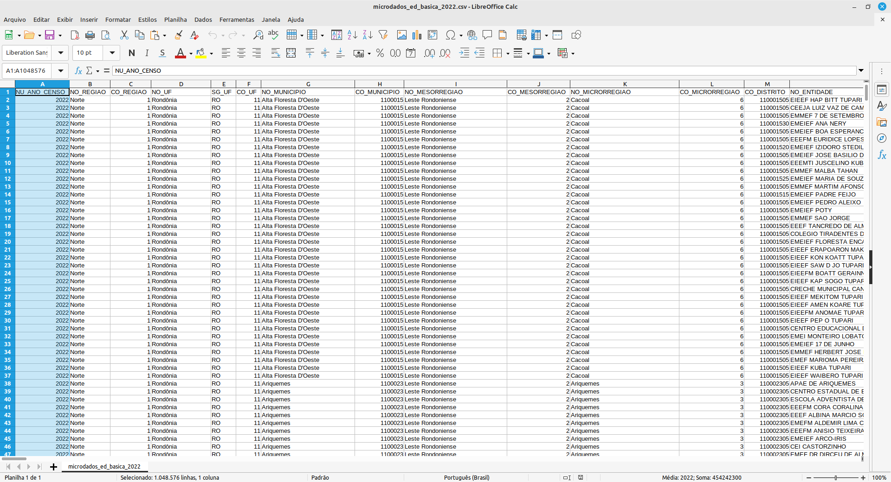
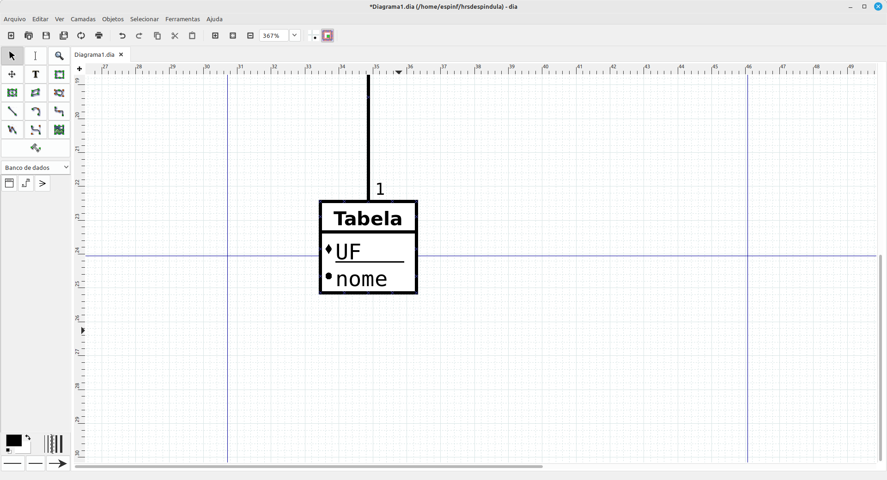

# Banco de Dados

```{r setup, include=TRUE}
knitr::opts_chunk$set(echo = TRUE)
```

```{bash eval=FALSE, include=TRUE}
hrsdespindula@h9:~$ cd Downloads/

hrsdespindula@h9:~/Downloads$ ls
'abelhas no inverno aquecedores.docx'   meu_script.py
'abelhas no inverno aquecedores.pdf'    ML
 BD                                     template-artigo-de-periodico.docx
 complaints.csv.tar.xz                 'template_trabalho_academico_-2(1).doc'
 DSBD2024-Aula01b.pdf                  'template_trabalho_academico_-2(2).doc'
 DSBD2024-Aula01c.pdf                   template_trabalho_academico_-2.doc
 DSBD2024-Aula01.pdf                    template_trabalho_academico_ODT.odt
 lab1.tar.gz
 
hrsdespindula@h9:~/Downloads$ cd BD

hrsdespindula@h9:~/Downloads/BD$ ls
complaints.csv

hrsdespindula@h9:~/Downloads/BD$ grep 'PRODUTO DE TESTES' complaints.csv 

hrsdespindula@h9:~/Downloads/BD$ grep 'PRODUTO DE TESTES' complaints.csv 
2022-08-15,PRODUTO DE TESTES,Checking account,Managing an account,Deposits and withdrawals,,,JPMORGAN CHASE & CO.,PA,17972,Older American,N/A,Phone,2022-08-15,Closed with explanation,Yes,N/A,5879503
```

```{bash eval=FALSE, include=TRUE}
hrsdespindula@h9:~/DSBD/07-Processamento_de_Big_Data$ python3 bd_complains_prof.py
Tempo para ler: 65.2702887058258 segundos
Pressione Enter para continuar...
Tempo para buscar: 0.1844804286956787 segundos
        Date received            Product  ... Consumer disputed? Complaint ID
3923941    2022-08-15  PRODUTO DE TESTES  ...                NaN      5879503

[1 rows x 18 columns]
```

Precisou atualizar o pandas...
```{bash eval=FALSE, include=TRUE}
pip install --upgrade numpy
pip install --upgrade pandas
```


```{bash eval=FALSE, include=TRUE}
hrsdespindula@h9:~$ cd DSBD/
hrsdespindula@h9:~/DSBD$ cd 07-Processamento_de_Big_Data/
hrsdespindula@h9:~/DSBD/07-Processamento_de_Big_Data$ time python3 bd_complains.py
```


```{python bd_complains.py}
import pandas as pd
import time

nomeArq = "/home/espinf/hrsdespindula/Downloads/BD/complaints.csv"

df = pd.read_csv(nomeArq)

df.head()

#df.describe( )

```

## Bancos de Dados Relacionais


{width=50%}


```{bash eval=FALSE, include=TRUE}
sudo apt-get install sqlite3
```

```{".sqliterc" eval=FALSE, include=TRUE}
.headers ON
PRAGMA foreign_keys = ON;
```


```{bash eval=FALSE, include=TRUE}
hrsdespindula@h9:~$ cd DSBD/

hrsdespindula@h9:~/DSBD$ cd 07-Processamento_de_Big_Data/

hrsdespindula@h9:~/DSBD/07-Processamento_de_Big_Data$ sqlite3 dsbd.db
SQLite version 3.34.1 2021-01-20 14:10:07
Enter ".help" for usage hints.
sqlite> 
sqlite> .exit
hrsdespindula@h9:~/DSBD/07-Processamento_de_Big_Data$ sqlite3 dsbd.db
SQLite version 3.34.1 2021-01-20 14:10:07
Enter ".help" for usage hints.
sqlite> 

```


```{sql eval=FALSE, include=TRUE}

CREATE TABLE nome_tabela(
coluna1 tipo,
coluna2 tipo,
coluna3 tipo,
…
);

## Em MAIUSCULA os comandos do banco
## Atenção: comandos devem terminar com ";"

## Onde o tipo pode ser um dos seguintes:
## TEXT
## NUMERIC
## INTEGER
## REAL
## Você vai encontrar o tipo dos dados na literatura como o “Domínio do Dado”.

INSERT INTO nome_tabela (nome_coluna1, nome_coluna2, …) VALUES
(valor_coluna1, valor_coluna2,...);

```

Criando tebela
```{sql eval=FALSE, include=TRUE}
CREATE TABLE estados(
uf TEXT,
nome TEXT
);
```

Colocando dados na tabela
```{sql eval=FALSE, include=TRUE}
INSERT INTO estados (uf, nome) VALUES ('PR', 'Paraná');
```

Consulta
```{sql eval=FALSE, include=TRUE}
SELECT uf, nome FROM estados

## Se você quer mostrar todas as colunas, use *.
SELECT * FROM estados;
```

Usando...
```{bash eval=FALSE, include=TRUE}
hrsdespindula@h9:~/DSBD/07-Processamento_de_Big_Data$ sqlite3 dsbd.db
SQLite version 3.34.1 2021-01-20 14:10:07
Enter ".help" for usage hints.
sqlite> 

sqlite> CREATE TABLE estados(
uf TEXT,
nome TEXT
);

sqlite> INSERT INTO estados (uf, nome) VALUES ('PR', 'Paraná');

sqlite> SELECT uf, nome FROM estados;
uf|nome
PR|Paraná

sqlite> SELECT * FROM estados;
uf|nome
PR|Paraná
```


```{bash eval=FALSE, include=TRUE}
hrsdespindula@h9:~/DSBD/07-Processamento_de_Big_Data$ sqlite3 dsbd.db
-- Loading resources from /home/espinf/hrsdespindula/.sqliterc
SQLite version 3.34.1 2021-01-20 14:10:07
Enter ".help" for usage hints.

sqlite> INSERT INTO estados (uf, nome) VALUES ('AC', 'Acre');
INSERT INTO estados (uf, nome) VALUES ('AL', 'Alagoas');
INSERT INTO estados (uf, nome) VALUES ('AP', 'Amapá');
INSERT INTO estados (uf, nome) VALUES ('AM', 'Amazonas');
INSERT INTO estados (uf, nome) VALUES ('BA', 'Bahia');
INSERT INTO estados (uf, nome) VALUES ('CE', 'Ceará');
INSERT INTO estados (uf, nome) VALUES ('DF', 'Distrito Federal');
INSERT INTO estados (uf, nome) VALUES ('ES', 'Espírito Santo');
INSERT INTO estados (uf, nome) VALUES ('GO', 'Goiás');
INSERT INTO estados (uf, nome) VALUES ('MA', 'Maranhão');
INSERT INTO estados (uf, nome) VALUES ('MT', 'Mato Grosso');
INSERT INTO estados (uf, nome) VALUES ('MS', 'Mato Grosso do Sul');
INSERT INTO estados (uf, nome) VALUES ('MG', 'Minas Gerais');
INSERT INTO estados (uf, nome) VALUES ('PA', 'Pará');
INSERT INTO estados (uf, nome) VALUES ('PB', 'Paraíba');
INSERT INTO estados (uf, nome) VALUES ('PR', 'Paraná');
INSERT INTO estados (uf, nome) VALUES ('PE', 'Pernambuco');
INSERT INTO estados (uf, nome) VALUES ('PI', 'Piauí');
INSERT INTO estados (uf, nome) VALUES ('RJ', 'Rio de Janeiro');
INSERT INTO estados (uf, nome) VALUES ('RN', 'Rio Grande do Norte');
INSERT INTO estados (uf, nome) VALUES ('RS', 'Rio Grande do Sul');
INSERT INTO estados (uf, nome) VALUES ('RO', 'Rondônia');
INSERT INTO estados (uf, nome) VALUES ('RR', 'Roraima');
INSERT INTO estados (uf, nome) VALUES ('SC', 'Santa Catarina');
INSERT INTO estados (uf, nome) VALUES ('SP', 'São Paulo');
INSERT INTO estados (uf, nome) VALUES ('SE', 'Sergipe');
INSERT INTO estados (uf, nome) VALUES ('TO', 'Tocantins');


sqlite> SELECT * FROM estados;
uf|nome
PR|Paraná
AC|Acre
AL|Alagoas
AP|Amapá
AM|Amazonas
BA|Bahia
CE|Ceará
DF|Distrito Federal
ES|Espírito Santo
GO|Goiás
MA|Maranhão
MT|Mato Grosso
MS|Mato Grosso do Sul
MG|Minas Gerais 	
PA|Pará
PB|Paraíba
PR|Paraná
PE|Pernambuco
PI|Piauí
RJ|Rio de Janeiro
RN|Rio Grande do Norte
RS|Rio Grande do Sul
RO|Rondônia
RR|Roraima
SC|Santa Catarina
SP|São Paulo
SE|Sergipe
TO|Tocantins
sqlite> 

```

O banco deixou que fizéssemos o cadastro de dois estados PR.
Erro.
Ao criarmos uma tabela, precisamos definir uma chave primária.
A chave primária é um identificador único não nulo.
Vai servir como chave para encontrarmos o item na tabela.
No caso dos estados brasileiros, a UF é a chave.
Não podem existir dois estados com mesmo identificador de UF.

```{bash eval=FALSE, include=TRUE}

sqlite> DROP TABLE estados;

sqlite> SELECT * FROM estados;
Error: no such table: estados

sqlite> CREATE TABLE estados(
uf TEXT PRIMARY KEY,
nome TEXT
);

sqlite> SELECT * FROM estados;

sqlite> INSERT INTO estados (uf, nome) VALUES ('PR', 'Paraná');

sqlite> INSERT INTO estados (uf, nome) VALUES ('PR', 'Paraná');
Error: UNIQUE constraint failed: estados.uf

sqlite> INSERT INTO estados (uf) VALUES ('BA');

sqlite> SELECT * FROM estados;
uf|nome
PR|Paraná
BA|
```

O banco aceita estados sem nome.
Por padrão, os campos podem ser vazios (NULL). Podemos alterar esse comportamento marcando como NOT NULL

```{bash eval=FALSE, include=TRUE}
sqlite> DROP TABLE estados;

sqlite> CREATE TABLE estados(
uf TEXT PRIMARY KEY,
nome TEXT NOT NULL
);

sqlite> INSERT INTO estados (uf) VALUES ('BA');
Error: NOT NULL constraint failed: estados.nome

sqlite> INSERT INTO estados (uf, nome) VALUES ('PR', 'Paraná');
INSERT INTO estados (uf, nome) VALUES ('AA', 'Paraná');

sqlite> SELECT * FROM estados;
uf|nome
PR|Paraná
AA|Paraná
```

O banco está aceitando que nomes de estados se repitam.
Note que o nome não é uma chave primária (só existe uma chave, que é a UF).
Mas o nome do estado também deveria ser único.

```{sql eval=FALSE, include=TRUE}
INSERT INTO estados (uf, nome) VALUES ('AC', 'Acre');
INSERT INTO estados (uf, nome) VALUES ('AL', 'Alagoas');
INSERT INTO estados (uf, nome) VALUES ('AP', 'Amapá');
INSERT INTO estados (uf, nome) VALUES ('AM', 'Amazonas');
INSERT INTO estados (uf, nome) VALUES ('BA', 'Bahia');
INSERT INTO estados (uf, nome) VALUES ('CE', 'Ceará');

```

```{sql eval=FALSE, include=TRUE}
sqlite> DROP TABLE estados;

sqlite> CREATE TABLE estados(
uf TEXT PRIMARY KEY,
nome TEXT NOT NULL
);

sqlite> INSERT INTO estados (uf, nome) VALUES ('AC', 'Acre');
INSERT INTO estados (uf, nome) VALUES ('AL', 'Alagoas');
INSERT INTO estados (uf, nome) VALUES ('AP', 'Amapá');
INSERT INTO estados (uf, nome) VALUES ('AM', 'Amazonas');
INSERT INTO estados (uf, nome) VALUES ('BA', 'Bahia');
INSERT INTO estados (uf, nome) VALUES ('CE', 'Ceará');
INSERT INTO estados (uf, nome) VALUES ('DF', 'Distrito Federal');
INSERT INTO estados (uf, nome) VALUES ('ES', 'Espírito Santo');
INSERT INTO estados (uf, nome) VALUES ('GO', 'Goiás');
INSERT INTO estados (uf, nome) VALUES ('MA', 'Maranhão');
INSERT INTO estados (uf, nome) VALUES ('MT', 'Mato Grosso');
INSERT INTO estados (uf, nome) VALUES ('MS', 'Mato Grosso do Sul');
INSERT INTO estados (uf, nome) VALUES ('MG', 'Minas Gerais');
INSERT INTO estados (uf, nome) VALUES ('PA', 'Pará');
INSERT INTO estados (uf, nome) VALUES ('PB', 'Paraíba');
INSERT INTO estados (uf, nome) VALUES ('PR', 'Paraná');
INSERT INTO estados (uf, nome) VALUES ('PE', 'Pernambuco');
INSERT INTO estados (uf, nome) VALUES ('PI', 'Piauí');
INSERT INTO estados (uf, nome) VALUES ('RJ', 'Rio de Janeiro');
INSERT INTO estados (uf, nome) VALUES ('RN', 'Rio Grande do Norte');
INSERT INTO estados (uf, nome) VALUES ('RS', 'Rio Grande do Sul');
INSERT INTO estados (uf, nome) VALUES ('RO', 'Rondônia');
INSERT INTO estados (uf, nome) VALUES ('RR', 'Roraima');
INSERT INTO estados (uf, nome) VALUES ('SC', 'Santa Catarina');
INSERT INTO estados (uf, nome) VALUES ('TO', 'Tocantins');

```

```{bash eval=FALSE, include=TRUE}
sqlite> INSERT INTO estados (uf, nome) VALUES ('PR', 'Paraná');
INSERT INTO estados (uf, nome) VALUES ('AA', 'Paraná');
Error: UNIQUE constraint failed: estados.nome

sqlite> DROP TABLE estados;

sqlite> CREATE TABLE estados(
uf TEXT PRIMARY KEY,
nome TEXT NOT NULL
);

sqlite> INSERT INTO estados (uf, nome) VALUES ('AC', 'Acre');
INSERT INTO estados (uf, nome) VALUES ('AL', 'Alagoas');
INSERT INTO estados (uf, nome) VALUES ('AP', 'Amapá');
INSERT INTO estados (uf, nome) VALUES ('AM', 'Amazonas');
INSERT INTO estados (uf, nome) VALUES ('BA', 'Bahia');
INSERT INTO estados (uf, nome) VALUES ('CE', 'Ceará');
INSERT INTO estados (uf, nome) VALUES ('DF', 'Distrito Federal');
INSERT INTO estados (uf, nome) VALUES ('ES', 'Espírito Santo');
INSERT INTO estados (uf, nome) VALUES ('GO', 'Goiás');
INSERT INTO estados (uf, nome) VALUES ('MA', 'Maranhão');
INSERT INTO estados (uf, nome) VALUES ('MT', 'Mato Grosso');
INSERT INTO estados (uf, nome) VALUES ('MS', 'Mato Grosso do Sul');
INSERT INTO estados (uf, nome) VALUES ('MG', 'Minas Gerais');
INSERT INTO estados (uf, nome) VALUES ('PA', 'Pará');
INSERT INTO estados (uf, nome) VALUES ('PB', 'Paraíba');
INSERT INTO estados (uf, nome) VALUES ('PR', 'Paraná');
INSERT INTO estados (uf, nome) VALUES ('PE', 'Pernambuco');
INSERT INTO estados (uf, nome) VALUES ('PI', 'Piauí');
INSERT INTO estados (uf, nome) VALUES ('RJ', 'Rio de Janeiro');
INSERT INTO estados (uf, nome) VALUES ('RN', 'Rio Grande do Norte');
INSERT INTO estados (uf, nome) VALUES ('RS', 'Rio Grande do Sul');
INSERT INTO estados (uf, nome) VALUES ('RO', 'Rondônia');
INSERT INTO estados (uf, nome) VALUES ('RR', 'Roraima');
INSERT INTO estados (uf, nome) VALUES ('SC', 'Santa Catarina');
INSERT INTO estados (uf, nome) VALUES ('TO', 'Tocantins');

SELECT * FROM estados;
uf|nome
AC|Acre
AL|Alagoas
AP|Amapá
AM|Amazonas
BA|Bahia
CE|Ceará
DF|Distrito Federal
ES|Espírito Santo
GO|Goiás
MA|Maranhão
MT|Mato Grosso
MS|Mato Grosso do Sul
MG|Minas Gerais
PA|Pará
PB|Paraíba
PR|Paraná
PE|Pernambuco
PI|Piauí
RJ|Rio de Janeiro
RN|Rio Grande do Norte
RS|Rio Grande do Sul
RO|Rondônia
RR|Roraima
SC|Santa Catarina
SP|São Paulo
SE|Sergipe
TO|Tocantins

sqlite> .exit
```

```{bash eval=FALSE, include=TRUE}
hrsdespindula@h9:~/DSBD/07-Processamento_de_Big_Data$ sqlite3 dsbd.db < estados.sql
uf|nome
AC|Acre
AL|Alagoas
AP|Amapá
AM|Amazonas
BA|Bahia
CE|Ceará
DF|Distrito Federal
ES|Espírito Santo
GO|Goiás
MA|Maranhão
MT|Mato Grosso
MS|Mato Grosso do Sul
MG|Minas Gerais
PA|Pará
PB|Paraíba
PR|Paraná
PE|Pernambuco
PI|Piauí
RJ|Rio de Janeiro
RN|Rio Grande do Norte
RS|Rio Grande do Sul
RO|Rondônia
RR|Roraima
SC|Santa Catarina
SP|São Paulo
SE|Sergipe
TO|Tocantins


sqlite> DROP TABLE estados;
sqlite> CREATE TABLE estados(
uf TEXT PRIMARY KEY,
nome TEXT NOT NULL
);
sqlite> .exit
hrsdespindula@h9:~/DSBD/07-Processamento_de_Big_Data$ sqlite3 dsbd.db < estados2.sql 
hrsdespindula@h9:~/DSBD/07-Processamento_de_Big_Data$ sqlite3 dsbd.db < estados.sql 
uf|nome
AC|Acre
AL|Alagoas
AP|Amapá
AM|Amazonas
BA|Bahia
CE|Ceará
DF|Distrito Federal
ES|Espírito Santo
GO|Goiás
MA|Maranhão
MT|Mato Grosso
MS|Mato Grosso do Sul
MG|Minas Gerais
PA|Pará
PB|Paraíba
PR|Paraná
PE|Pernambuco
PI|Piauí
RJ|Rio de Janeiro
RN|Rio Grande do Norte
RS|Rio Grande do Sul
RO|Rondônia
RR|Roraima
SC|Santa Catarina
TO|Tocantins

```


```{bash eval=FALSE, include=TRUE}
hrsdespindula@h9:~/DSBD/07-Processamento_de_Big_Data$ sqlite3 dsbd.db
-- Loading resources from /home/espinf/hrsdespindula/.sqliterc
SQLite version 3.34.1 2021-01-20 14:10:07
Enter ".help" for usage hints.

sqlite> SELECT * FROM estados WHERE uf = 'PR';
uf|nome
PR|Paraná

sqlite> SELECT * FROM estados WHERE uf <> 'PR';
uf|nome
AC|Acre
AL|Alagoas
AP|Amapá
AM|Amazonas
BA|Bahia
CE|Ceará
DF|Distrito Federal
ES|Espírito Santo
GO|Goiás
MA|Maranhão
MT|Mato Grosso
MS|Mato Grosso do Sul
MG|Minas Gerais
PA|Pará
PB|Paraíba
PE|Pernambuco
PI|Piauí
RJ|Rio de Janeiro
RN|Rio Grande do Norte
RS|Rio Grande do Sul
RO|Rondônia
RR|Roraima
SC|Santa Catarina
SP|São Paulo
SE|Sergipe
TO|Tocantins

## Usa % para indicar “qualquer coisa”.

sqlite> SELECT * FROM estados WHERE nome LIKE 'Par%';
uf|nome
PA|Pará
PB|Paraíba
PR|Paraná

sqlite> SELECT * FROM estados WHERE nome LIKE '%ão%';
uf|nome
MA|Maranhão
SP|São Paulo


sqlite> SELECT * FROM estados ORDER BY uf DESC;
uf|nome
TO|Tocantins
SP|São Paulo
SE|Sergipe
SC|Santa Catarina
RS|Rio Grande do Sul
RR|Roraima
RO|Rondônia
RN|Rio Grande do Norte
RJ|Rio de Janeiro
PR|Paraná
PI|Piauí
PE|Pernambuco
PB|Paraíba
PA|Pará
MT|Mato Grosso
MS|Mato Grosso do Sul
MG|Minas Gerais
MA|Maranhão
GO|Goiás
ES|Espírito Santo
DF|Distrito Federal
CE|Ceará
BA|Bahia
AP|Amapá
AM|Amazonas
AL|Alagoas
AC|Acre

sqlite> SELECT COUNT(*) FROM estados;
COUNT(*)
27

sqlite> SELECT COUNT(*) FROM estados WHERE nome LIKE 'Par%';
COUNT(*)
3

```


```{bash eval=FALSE, include=TRUE}
hrsdespindula@h9:~/DSBD/07-Processamento_de_Big_Data$ sqlite3 dsbd.db
-- Loading resources from /home/espinf/hrsdespindula/.sqliterc
SQLite version 3.34.1 2021-01-20 14:10:07
Enter ".help" for usage hints.

sqlite> SELECT COUNT(*) FROM estados;
COUNT(*)
25

sqlite> DELETE FROM estados;

sqlite> SELECT COUNT(*) FROM estados;
COUNT(*)
0

hrsdespindula@h9:~/DSBD/07-Processamento_de_Big_Data$ sqlite3 dsbd.db < estados2.sql 
hrsdespindula@h9:~/DSBD/07-Processamento_de_Big_Data$ sqlite3 dsbd.db
-- Loading resources from /home/espinf/hrsdespindula/.sqliterc
SQLite version 3.34.1 2021-01-20 14:10:07
Enter ".help" for usage hints.

sqlite> SELECT COUNT(*) FROM estados;
COUNT(*)
25

sqlite> DELETE FROM estados WHERE nome LIKE 'Par%';

sqlite> SELECT COUNT(*) FROM estados;
COUNT(*)
22

sqlite> DROP TABLE estados;

sqlite> CREATE TABLE estados(
uf TEXT PRIMARY KEY,
nome TEXT NOT NULL
);

sqlite> .exit

hrsdespindula@h9:~/DSBD/07-Processamento_de_Big_Data$ sqlite3 dsbd.db < estados2.sql 
hrsdespindula@h9:~/DSBD/07-Processamento_de_Big_Data$ sqlite3 dsbd.db
-- Loading resources from /home/espinf/hrsdespindula/.sqliterc
SQLite version 3.34.1 2021-01-20 14:10:07
Enter ".help" for usage hints.

sqlite> SELECT COUNT(*) FROM estados;
COUNT(*)
25

sqlite> SELECT * FROM estados ORDER BY uf ASC;
uf|nome
AC|Acre
AL|Alagoas
AM|Amazonas
AP|Amapá
BA|Bahia
CE|Ceará
DF|Distrito Federal
ES|Espírito Santo
GO|Goiás
MA|Maranhão
MG|Minas Gerais
MS|Mato Grosso do Sul
MT|Mato Grosso
PA|Pará
PB|Paraíba
PE|Pernambuco
PI|Piauí
PR|Paraná
RJ|Rio de Janeiro
RN|Rio Grande do Norte
RO|Rondônia
RR|Roraima
RS|Rio Grande do Sul
SC|Santa Catarina
TO|Tocantins


sqlite> UPDATE estados SET nome = 'PARANA' WHERE uf = 'PR' ;


sqlite> SELECT * FROM estados ORDER BY uf ASC;
uf|nome
AC|Acre
AL|Alagoas
AM|Amazonas
AP|Amapá
BA|Bahia
CE|Ceará
DF|Distrito Federal
ES|Espírito Santo
GO|Goiás
MA|Maranhão
MG|Minas Gerais
MS|Mato Grosso do Sul
MT|Mato Grosso
PA|Pará
PB|Paraíba
PE|Pernambuco
PI|Piauí
PR|PARANA
RJ|Rio de Janeiro
RN|Rio Grande do Norte
RO|Rondônia
RR|Roraima
RS|Rio Grande do Sul
SC|Santa Catarina
TO|Tocantins

sqlite> UPDATE estados SET nome = 'Paraná' WHERE uf = 'PR' ;

sqlite> SELECT * FROM estados ORDER BY uf ASC;
uf|nome
AC|Acre
AL|Alagoas
AM|Amazonas
AP|Amapá
BA|Bahia
CE|Ceará
DF|Distrito Federal
ES|Espírito Santo
GO|Goiás
MA|Maranhão
MG|Minas Gerais
MS|Mato Grosso do Sul
MT|Mato Grosso
PA|Pará
PB|Paraíba
PE|Pernambuco
PI|Piauí
PR|Paraná
RJ|Rio de Janeiro
RN|Rio Grande do Norte
RO|Rondônia
RR|Roraima
RS|Rio Grande do Sul
SC|Santa Catarina
TO|Tocantins


```

### A cláusula Where

A cláusula WHERE é comumente utilizada para filtrar os dados.
Veja detalhes aqui: <https://www.sqlitetutorial.net/sqlite-where>


```{sql eval=FALSE, include=TRUE}

-- Comentario de 1 linha

/*
Bloco de comentarios
*/
```


```{bash eval=FALSE, include=TRUE}
```


```{bash eval=FALSE, include=TRUE}
```


```{bash eval=FALSE, include=TRUE}
```


```{bash eval=FALSE, include=TRUE}

```


```{sql eval=FALSE, include=TRUE}


```

```{sql eval=FALSE, include=TRUE}
```

```{sql eval=FALSE, include=TRUE}
```

```{sql eval=FALSE, include=TRUE}
```

```{sql eval=FALSE, include=TRUE}
```

```{sql eval=FALSE, include=TRUE}
```


{width=50%}


Fonte: <https://solutions.posit.co/connections/db/databases/sqlite/>
```{r}
library(DBI)
# Create an ephemeral in-memory RSQLite database
con <- dbConnect(RSQLite::SQLite(), ":memory:")

dbListTables(con)

dbWriteTable(con, "mtcars", mtcars)
dbListTables(con)

dbListFields(con, "mtcars")

dbReadTable(con, "mtcars")

# You can fetch all results:
res <- dbSendQuery(con, "SELECT * FROM mtcars WHERE cyl = 4")
dbFetch(res)

dbClearResult(res)

# Or a chunk at a time
res <- dbSendQuery(con, "SELECT * FROM mtcars WHERE cyl = 4")
while(!dbHasCompleted(res)){
  chunk <- dbFetch(res, n = 5)
  print(nrow(chunk))
}

# Clear the result
dbClearResult(res)

# Disconnect from the database
dbDisconnect(con)
```

