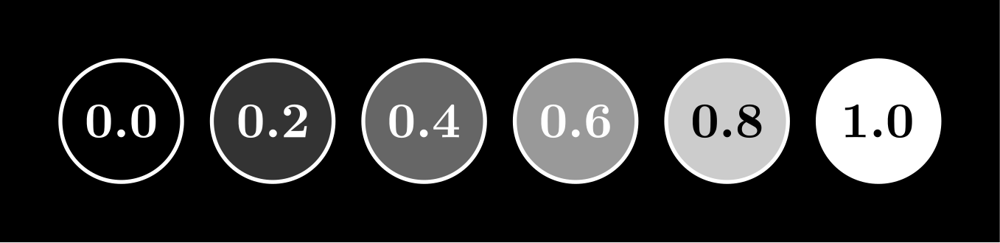
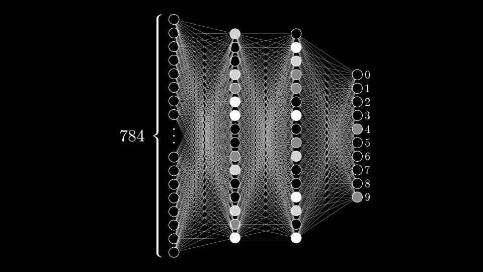

```{r setup, include=FALSE}
knitr::opts_chunk$set(echo = TRUE)
```

# Redes Neurais

Source: <https://www.3blue1brown.com/lessons/neural-networks>

## Chapter 01 - But what is a Neural Network?


The program above can identify hand-drawn digits 0-9 reasonably accurately. Give it a whirl if you haven’t already!

Although it does generally work, it requires a bit of coaxing to get there. In particular, the digit images it receives need to be centered and about the right size, which is why there's a pre-processing step before the digit image gets passed along to the neural network.

(Obs: Our focus in this series will be on just the neural network itself, which is arguably the most interesting part, but preparing data in this way is also very important for successful machine learning in the real world.)

While more modern neural networks can do a much better job at tasks like this, the network above is simple enough that you can understand exactly what it’s doing and how it was trained with almost no background. It’s also simple enough that you could train it on your own computer, while training more sophisticated networks can require a truly mind-boggling amount of computation.

(Obs: For example, when OpenAI trained their famous GPT-3 algorithm, it was estimated to require about $12 Million worth of computation.)

On the surface, a machine recognizing handwritten digits may not seem particularly impressive. After all, you know how to identify digits, and I bet you don’t even find it very hard. For example, you can tell instantly that these are all images of the digit three:


Each three is drawn differently, so the particular light-sensitive cells in your eye that fire are different for each, but something in that crazy smart visual cortex of yours resolves all these as representing the same idea, while recognizing images of other numbers as their own distinct ideas.

But if I told you to sit down and write a program like the one shown above, that takes in a grid of 28x28 pixels, and outputs a single number between 0 and 9, the task goes from comically trivial to dauntingly difficult.

Somehow identifying digits is incredibly easy for your brain to do, but almost impossible to describe how to do. The traditional methods of computer programming, with if statements and for loops and classes and objects and functions, just don’t seem suitable to tackle this problem.

But what if we could write a program that mimics the structure of your brain? That’s the idea behind neural networks. The hope is that by writing brain-inspired software, we might be able to create programs that tackle the kinds of fuzzy and difficult-to-reason-about problems that your mind is so good at solving.

(Obs: Although neural networks are inspired by the brain, they are by no means identical. It's a lot like the difference between a bird and an airplane. They achieve the same end goal using roughly the same strategies, but with some pretty major differences when it comes to the details.)

Moreover, just as you learn by seeing many examples, the “learning” part of machine learning comes from the fact that we never give the program any specific instructions for how to identify digits. Instead, we’ll show it many examples of hand-drawn digits together with labels for what they should be, and leave it up to the computer to adapt the network based on each new example.

By the way, recognizing handwritten digits is a classic example for introducing this topic, and I’m happy to stick with the status quo here. Since it’s such a common starting point, there are plenty of other resources available that tackle the same subject matter in more depth for people who want to dig in deeper. If that sounds like you, take a look at this excellent online textbook by Michael Nielsen, which includes code that you can download and play with to really get your hands dirty.

(Book: <http://neuralnetworksanddeeplearning.com/>)

### The Structure of a Neural Network

This lesson is all about motivating and understanding the structure and mathematical description of a neural network, while the next lesson will focus on how to train it with labeled examples.

There are many variants of neural networks, such as convolutional neural networks (CNN), recurrent neural networks (RNN), transformers, and countless others. In recent years there’s been a boom in research of these variants. But the first step to understanding any of them is to build up the simplest, plain vanilla form with no added frills.


Leg: The simple network we’re using to identify digits is just a few layers of neurons linked together.

### Neurons

Right now, when I say neuron, all I want you to think is “a thing that holds a number.” Specifically, a number between 0.0 and 1.0. Neural networks are really just a bunch of neurons connected together.

This number inside the neuron is called the “activation” of that neuron, and the image you might have in your mind is that each neuron is lit up when its activation is a high number.


Leg: Every neuron has an activation between 0.0 and 1.0, sort of analogous to how neurons in the brain can be active or inactive.

All the information passing through our neural network is stored in these neurons. So we need to represent the inputs and outputs of our network (the images and digit predictions) in terms of these neuron values between 0.0 and 1.0.


Leg: Each pixel in the original image has a value between 0.0 (black) and 1.0 (white).

All of our digit images have $28×28=784$ pixels, each with a brightness value between 0.0 (black) and 1.0 (white). To represent this in the network, we’ll create a layer of 784 neurons, where each neuron corresponds to a particular pixel.


Leg: The input layer contains 784 neurons, each of which corresponds to a single pixel in the original image.

When we want to feed the network an image, we’ll set each input neuron’s activation to the brightness of its corresponding pixel.

(Obs: We can't fit all 784 neurons in our diagram, so you're only seeing the first and last neurons, which correspond to the first pixels of the first row and the last pixels of the last row of the image.
That's an admittedly boring selection, because for almost every digit image, those pixels will just be black. But as you're reading, keep in mind that there's a lot of exciting stuff going on behind the little "...". Many of the neurons you can't see are active!)

The last layer of our network will have 10 neurons, each representing one of the possible digits. The activation in these neurons, again some number between 0.0 and 1.0, will represent how much the system thinks an image corresponds to a given digit.


Leg: The output layer of our network has 10 neurons. Each neuron corresponds to a particular digit that the image could contain.

Take a look at the following image:


Based on the output layer of the network shown above, what kind of digit does this network think it’s looking at? How certain does it feel?

Your answer:

Our answer: It’s having trouble deciding whether the input image is a 4 or a 9.

### The Hidden Layers


There will also be some layers in between, called “hidden layers”, which for the time being should just be a giant question mark for how on earth this process of recognizing digits will be handled.

In this network I have 2 hidden layers, each with 16 neurons, which is admittedly kind of an arbitrary choice. To be honest, I chose 2 layers based on how I want to motivate the structure in just a moment, and 16 was simply a nice number to fit on the screen. In practice, there’s a lot of room to experiment with the specific structure.

### Why Use Layers?

You’ll notice how in these drawings each neuron from one layer is connected to each neuron of the next with a little line. This is meant to indicate how the activation of each neuron in one layer, the little number inside it, has some influence on the activation of each neuron in the next layer.

[Video: <https://3b1b-posts.us-east-1.linodeobjects.com/content/lessons/2017/neural-networks/network-propagation.mp4#t=0.001>]
Leg: Watching the activations in each layer propagate through to determine the activations in the next can be quite mesmerizing.

However, not all these connections are equal. Some will be stronger than others, and as you’ll see shortly, determining how strong these connections are is really the heart of how a neural network operates, as an information processing mechanism.

But before jumping into the math for how one layer influences the next, or how training works, let’s talk about why it’s even reasonable to expect a layered structure like this to behave intelligently. What are we expecting here? What’s the best hope for what those middle layers are doing? Why not just directly connect all the pixels to the final output we want?

Well, when you or I recognize digits, we piece together various components like loops and lines.


Leg: Each digit can be broken into smaller, recognizable subcomponents.

In a perfect world, we might hope that each neuron in the second-to-last layer corresponds to one of these subcomponents. That anytime you feed in an image with, say, a loop up top, there is some specific neuron whose activation will be close to 1.0.


And I don’t mean just this exact loop of pixels. The hope would be that any generally loopy pattern toward the top of the image sets off this neuron. That way, going from this third layer to the last one would only require learning which combinations of subcomponents correspond to which digits.

Of course, this just kicks the problem down the road, because how would you recognize these subcomponents, or even learn what the right subcomponents should be? And I still haven’t talked about how exactly one layer influences the next! But run with me on this for a moment.

Recognizing a loop can also break down into subproblems. One reasonable way to do that would be to first recognize the various edges that make it up.


Leg: A loop can be broken down into several small edges.

Similarly, a long line, as you might see in the digits 1, 4 or 7, is really just a long edge. Or maybe you think of it as a certain pattern of several smaller edges.


Leg: A long line is also just a bunch of edges.

So our hope might be that each neuron in the second layer of the network corresponds to some little edge. Maybe when an image comes in, it lights up neurons associated with all the specific little edges inside that image. This, in turn, would light up the neurons in the third layer associated with larger scale patterns like loops and long lines, which would then cause some neuron from the final layer to fire which corresponds to the appropriate digit.


Whether or not this is how our final network actually works is another question. (One that we’ll revisit after seeing how to train this network.) But this is a hope that we might have.

### Layers Break Problems Into Bite-Sized Pieces

You can imagine how being able to detect edges and patterns would also be useful for other image-recognition tasks.


Leg: Edge detection isn’t just for digits! It’s a useful step for all kinds of image-recognition problems. Original lion image by Kevin Pluck, licensed under CC BY 2.0

And beyond image recognition, there are all sorts of intelligent tasks that you can break down into layers of abstraction.

Parsing speech, for example, involves parsing raw audio into distinct sounds, which combine to make certain syllables, which combine to form words, which combine to make up phrases and more abstract thoughts, etc.


The layered structure of the neural network is great because it allows you to break down difficult problems into bite-size steps, so that moving from one layer to the next is relatively straightforward.

### How Information Passes Between Layers

With this as a general idea, how do you actually implement it? The goal is to have some mechanism that could conceivably combine pixels into edges, or edges into patterns, or patterns into digits. It would be especially elegant if all of those different steps used the same mathematical procedure.

To zoom in on one very specific example, let’s say that the hope is for this one particular neuron in the second layer to pick up on whether or not the image has an edge in this spot here:


Leg: We want this one, specific neuron in the second layer to pick up on whether the image contains this one, specific edge.

I want you to think about what parameters the network should have, what knobs and dials you should be able to tweak, so that it’s expressive enough to potentially capture this pattern. Or other pixel patterns. Or the pattern that several edges can make a loop, and other such things.

What we’ll do is assign a weight to each of the connections between our neuron and the neurons from the first layer. These weights are just numbers.


Each weight is an indication of how its neuron in the first layer is correlated with this new neuron in the second layer.

If the neuron in the first layer is on, then a positive weight suggests that the neuron in the second layer should also be on, and a negative weight suggests that the neuron in the second layer should be off.

Of course, these weights will interact and conflict in interesting ways, but the hope is that if we add up all the desires from all the weights, the end result will be a neuron that does a reasonably good job of detecting the edge we’re looking for (as long as the weights are well-chosen).

So to actually compute the value of this second-layer neuron, you take all the activations from the neurons in the first layer, and compute their weighted sum.

$$
w_1a_1+w_2a_2+w_3a_3+w_4a_4+ ⋯ +w_na_n
$$

It’s helpful to think of all those weights as being organized into a grid of their own:


Leg: Each weight is associated with one of the 784 input pixels. Arranging the weights into this 28x28 grid makes the correlations between the input image and the output activation clear.

I’m using blue pixels to indicate a positive weight, and red pixels to indicate a negative weight, with the brightness of that pixel being some depiction of the weight’s value.

What if we made the weights associated with almost all the pixels 0, except for some positive weights associated with these pixels in the region where we want to detect an edge?


Leg: With these weights, the neuron in the second layer will be more activated when pixels in this region are more activated.

Then taking a weighted sum of all pixel values really just amounts to adding up the values of the pixels in this region we care about.

But this pattern of weights will also pick up on big blobs of activated pixels! (Not just edges.) To really pick up on whether or not this is an edge, you might want to have some negative weights associated with the surrounding pixels. Then the sum will be largest when these pixels are bright, but the surrounding pixels are dark.


Leg: By adding some negative weights above and below, we make sure the neuron is most activated when a narrow edge of pixels is turned on, but the surrounding pixels are dark.


Suppose a neuron in the second layer has weights as indicated above. Rank the four images (A, B, C, and D) based on how much they would activate that neuron:

- A > B > C > D
- B > D > A > C (correct)
- B > D > C > A
- D > C > B > A

Explanation: B gives the highest activation because it only activates the neurons with positive weights. C gives the lowest activation because it is the exact inverse of B. A has a weighted sum of zero because all the input neurons are off, but D has a positive activation because it activates 24 positive weights but only 16 negative weights.

### Sigmoid Squishification

The result of the weighted sum like this can be any number, but for this network we want the activations to be values between 0 and 1. So it’s common to pump this weighted sum into some function that squishes the real number line into the range between 0 and 1.


Leg: There’s no limit to how big or small the weighted sum might be. But our new neuron value should be between 0 and 1, so we need to somehow squish the range of possible outputs down to size.

One common function that does this is called the “sigmoid” function, also known as a logistic curve, which we represent using the symbol σσ. Very negative inputs end up close to 0, very positive inputs end up close to 1, and it steadily increases around 0. So the activation of the neuron here will basically be a measure of how positive the weighted sum is.


Leg: The sigmoid function is just the squishing function we need!

$\sigma (−1000)$ is closest to which of the following values?

- $\infty$
- $-1$
- $0$ (Correct)
- $1$


But maybe it’s not that we want the neuron to light up when this weighted sum is bigger than 0. Maybe we only want it to be meaningfully active when that sum is bigger than, say, 10. That is, we want some bias for it to be inactive.

What we’ll do then is add some number, like -10, to the weighted sum before plugging it into the sigmoid function that squishes everything into the range between 0 and 1.

We call this additional number a bias.


So the weights tell you what pixel pattern this neuron in the second layer is picking up on, and the bias tells you how big that weighted sum needs to be before the neuron gets meaningfully active.

### More Neurons

And that’s just one neuron! Every other neuron in the second layer is also going to have weighted connections to all 784 neurons from the first layer. Each neuron also has some bias, some other number to just add on to the weighted sum before squishing it with a sigmoid. That’s a lot to think about! With this hidden layer of 16 neurons, that’s 784x16 weights and 16 biases.

And all of this is just the connection from the first layer to the second. The connections between the other layers also have a bunch of weights and biases as well. All said and done, this network has 13,002 total weights and biases! 13,002 knobs and dials that can be tweaked to make this network behave in different ways.


Leg: This network has 13,002 weights and biases! That’s a lot to handle.

When we talk about learning, which we’ll do in the next lesson, we mean getting the computer to find an optimal setting for all these many, many numbers that will solve the problem at hand.

One thought experiment, which is at once both fun and horrifying, is to imagine setting all these weights and biases by hand. Purposefully setting weights to make the second layer pick up on edges, the third to pick up on patterns, and so on.

I personally find this satisfying, rather than just treating these networks as a total black box. Because when the network doesn’t perform the way you anticipate, if you’ve built up a feel for the meaning of those weights and biases in your mind, you have a starting place for experimenting with how to change this structure to be better.

Or, when the network does work, but not for the reasons you might expect, digging into what the weights and biases are doing is a good way to challenge your assumptions and really expose the full space of possible solutions.

### More Compact Notation

The actual function to get one neuron’s activation in terms of the activations in the previous layer is a bit cumbersome to write down.


Tracking all these indices takes a lot of effort, so let me show the more notationally compact way that these connections are represented.

Instead of computing a bunch of weighted sums like this one-by-one, we’ll use matrix multiplication to compute the activations of all the neurons in the next layer simultaneously.

First, organize all the activations from the first layer into a column vector.

[Video: <https://3b1b-posts.us-east-1.linodeobjects.com/content/lessons/2017/neural-networks/matrix-math-videos/activation-vector.mp4#t=0.001>]

Next, organize all the weights as a matrix, where each row of this matrix corresponds to all the connections between neurons in the first layer and a particular neuron in the next layer.

[Video: <https://3b1b-posts.us-east-1.linodeobjects.com/content/lessons/2017/neural-networks/matrix-math-videos/weight-matrix.mp4#t=0.001>]

Then the product Wa(0)Wa(0) is a column vector containing all the weighted sums for the neurons in the next layer.

(Obs: By the way, so much of machine learning comes down to having a good grasp of linear algebra, so if any of you want a nice visual understanding for matrices, and what matrix-vector multiplication means, take a look at the series I did on linear algebra. Especially chapter 3.)

[Video: <https://3b1b-posts.us-east-1.linodeobjects.com/content/lessons/2017/neural-networks/matrix-math-videos/weighted-sum.mp4#t=0.001>]

Instead of talking about adding the bias to each one of these values independently, we represent it by organizing all those biases into a vector, and adding the entire vector to the previous matrix-vector product:

[Video: <https://3b1b-posts.us-east-1.linodeobjects.com/content/lessons/2017/neural-networks/matrix-math-videos/bias-vector.mp4#t=0.001>]

Finally, I’ll wrap a sigmoid on the outside here, which is meant to represent applying the sigmoid function to each component of the result:

[Video: <https://3b1b-posts.us-east-1.linodeobjects.com/content/lessons/2017/neural-networks/matrix-math-videos/sigmoid.mp4#t=0.001>]

So, once you write this weight matrix and these vectors as their own symbols, you can communicate the full transition of activations from one layer to the next in a neat little expression:

[Video: <https://3b1b-posts.us-east-1.linodeobjects.com/content/lessons/2017/neural-networks/matrix-math-videos/final-equation.mp4#t=0.001>]
Leg: This tiny expression represents the computation of all the neurons in the next layer based on all the neurons in the previous layer, using the chosen weights and biases.

This makes the relevant code much cleaner and much faster, since many libraries optimize the heck out of matrix multiplication.

(Obs: 
These days, due to the demand for more machine learning and more powerful networks, there have been huge improvements in specialized hardware, making for much faster matrix multiplication, for example, Google's "Tensor processing unit", or TPU.

Half the time when you hear a company describe something like a "new neural architecture" meant for more powerful AI, what they really mean, when you look under the hood, is that they're multiplying matrices more quickly.

In fairness, this hardware often does more than just multiply matrices, but that's the main difference. And if you understand the above section, you understand why.)

### The Network Is Just a Function

Earlier I said to think of these neurons simply as “things that hold numbers”. Of course, the specific number these neurons hold depends on the image you feed in. So it’s actually more accurate to think of each neuron as a function. It takes in the activations of all neurons in the previous layer, and spits out a number between 0 and 1.

And really, the entire network is just a function! It takes in 784 numbers as its input, and spits out 10 numbers as its output. It’s an absurdly complicated function, because it takes over 13,000 parameters (weights and biases), and it involves iterating many matrix-vector products and sigmoid squishificaitons together. But it’s just a function nonetheless.


Leg: The entire neural network is a function that uses all its weights and biases to take in 784 input pixels and spit out 10 output numbers.

### Bonus Note 

In the original video that this article is based on, I talked to Lisha Li, who did her PhD work on the theoretical side of deep learning. She was a representative from Amplify Partners, who sponsored the original video, and she stopped by to discuss the sigmoid function. Specifically, to mention that it has a major drawback.


The problem is that the sigmoid function becomes super flat at the extremes, when the weighted sum being passed in has a large magnitude.

That might not seem like an issue. But as we’ll learn in the next lesson, the process of training the neural network essentially boils down to wiggling the values of all the weights and biases and watching what happens, like a 13,000-dimensional game of hot and cold. When a little wiggle to a weight is effective, you do more of that, and when it isn’t helpful, you do the opposite.

But since the sigmoid function gets so flat, wiggling the weights doesn’t really do much of anything! Which means that the process of learning takes a long time, and training networks is painful.

So nowadays, people tend to use a function called ReLU (Rectified Linear Unit) instead. It’s an absurdly pompous name for a very simple function. ReLU spits out 0 for any negative input, and doesn’t change the positive inputs at all.


Unlike sigmoid, the output of ReLU never flattens out, no matter how large the weighted sum becomes. So wiggling the weights always gives useful feedback about how the network should change. This makes the training process much faster and more efficient, especially as there are more layers involved, which is where the “deep” in “deep learning” comes from.

Earlier, I motivated the inclusion of the sigmoid by saying we want each neuron to hold a value between 0 and 1. While this is nice for the biological analogy of a neuron being either active or inactive, it’s not a necessary restriction; the relevant result at the output layer comes down to whether some neurons are more active than others, regardless of the scale.

You might wonder, then, why we need any function wrapped around the matrix product. Forget sigmoid and ReLU, what about nothing at all? If the only thing we were doing was rescaling by weights and adding biases at each layer, then the result of propagating the information from the input layer to the output layer would be nothing more than a sequence of matrix multiplications (with some offsets along the way), which means the full function is linear. We won’t go into the details here, but this would make the network dramatically less expressive. If you want to see a lovely visual explanation of what it means for data to be “linearly separable”, and why having some non-linear step in a neural network is important, you may enjoy this post by Chris Olah.

But of course, we shouldn’t get ahead of ourselves. We still need to discuss how the network learns from new data, which you can learn about in the following chapters.


## Chapter 05 - Backpropagation Calculus

The hard assumption here is that you’ve read the previous part, giving an intuitive walkthrough of the backpropagation algorithm. Here, we get a bit more formal and dive into the relevant calculus. It’s normal for this to be a little confusing, so be sure to pause and ponder throughout.

As a quick reminder, backpropagation is an algorithm for calculating the gradient of the cost function of a network.

$$\nabla C = 
\begin{bmatrix}
\frac{\partial C}{\partial w^{(1)}}\\
\frac{\partial C}{\partial b^{(1)}}\\
...\\
\frac{\partial C}{\partial w^{(L)}}\\
\frac{\partial C}{\partial b^{(L)}}\\
\end{bmatrix}$$

The entries of the gradient vector are the partial derivatives of the cost function with respect to all the different weights and biases of the network, so it’s really those derivatives that backpropagation helps us find.

In the last lesson we talked about the intuitive feeling you might have for how backpropagation works, so now our focus will be on connecting that intuition with the appropriate calculus.

(For those uncomfortable with the relevant calculus, I do have a whole series on the topic.)

The main goal here is to show how people in machine learning commonly think about the chain rule in the context of networks, which can feel a bit different than how most introductory calculus courses approach the subject.

### Calculating the Gradient with Backpropagation

Let’s start with an extremely simple network, where each layer has just one neuron.


Leg: We’ll start with a very simple neural network.

This network is determined by 3 weights (one for each connection) and 3 biases (one for each neuron, except the first), and our goal is to understand how changing each of them will affect the cost function. That way we know which adjustments will cause the most efficient decrease to the cost.

How strongly do these six weights and biases affect the value of the cost function?

For now, let’s just focus on the connection between the last two neurons. I’ll label the activation of that last neuron with a superscript LL, indicating which layer it’s in, so the activation of the previous neuron is a(L−1)a(L−1):

We label the activations of the neurons based on which layer they’re in, where LL is the last layer of the network.

To be clear, these are not exponents. They are just ways of indexing what layer we’re talking about, since we want to save subscripts for different indices later on.

Let’s say that for a certain training example, the desired output is yy. That means that the cost for this one training example is
$$
C_0 = (a^{(L)} - y)^2
$$

The cost to the network for this one training example is just the difference between the actual output and the desired output squared.

As a reminder, this last activation a(L)a(L) is determined by a weight, a bias, and the previous neuron’s activation, all pumped through some special nonlinear function like a sigmoid or a ReLU.

$$
a^{(L)} = \sigma (w^{(L)} a^{(L-1)} + b^{(L)})
$$

a(L)=σ(w(L)a(L−1)+b(L))
a(L)=σ(w(L)a(L−1)+b(L))

It’ll make things easier for us to give a special name to this weighted sum, like zz, with the same superscript as the activation:


$$
z^{(L)} = w^{(L)} a^{(L-1)} + b^{(L)}
$$

$$
a^{(L)} = \sigma (z^{(L)})
$$


A way you might conceptualize this is that the weight, the previous activation, and the bias together let us compute z(L)z(L), which in turn lets us compute a(L)a(L), which in turn, along with the constant yy, lets us compute the cost.

This tree shows which values depend on which other values in our network.

And of course, a(L−1)a(L−1) is influenced by its own weight and bias, which means our tree actually extends up higher...

...but we won’t focus on that right now.

All of these are just numbers, so it can be nice to think of each variable as having its own little number line.

Each of these variables has a value that we can place on its own little number line.
Computing The First Derivative

Our first goal is to understand how sensitive the cost C0C0​ is to small changes in the weight w(L)w(L). That is, we want to know the derivative ∂C0∂w(L)∂w(L)∂C0​​.

When you see this ∂w(L)∂w(L) term, think of it as meaning “some tiny nudge to w(L)w(L)”, like a change by 0.01. And think of this ∂C0∂C0​ term as meaning “whatever the resulting nudge to the cost is.” We want their ratio.

Conceptually, this tiny nudge to w(L)w(L) causes some nudge to z(L)z(L), which in turn causes some change to a(L)a(L), which directly influences the cost, C0C0​.

The nudge to w(L)w(L) has a chain of effects which eventually causes a nudge to C0C0​.

So we break this up by first taking the ratio of a tiny change to z(L)z(L) to the tiny change in w(L)w(L). That is, the derivative of z(L)z(L) with respect to w(L)w(L). Likewise, consider the ratio of a tiny change to a(L)a(L) to the tiny change in z(L)z(L) that caused it, as well as the ratio between the final nudge to C0C0​ and this intermediate nudge to a(L)a(L).

This is the chain rule, where multiplying these three ratios gives us the sensitivity of C0C0​ to small changes in w(L)w(L).
The Constituent Derivatives

We’ve broken down the derivative we actually want, ∂C0∂w(L)∂w(L)∂C0​​, into its constituent parts. Now we just need to compute the values of the three individual derivatives that make it up.

To compute each derivative, we’ll use some relevant formula from the way we’ve defined our neural network.
z(L)=w(L)a(L−1)+b(L)⟶∂z(L)∂w(L)=a(L−1)a(L)=σ(z(L))⟶∂a(L)∂z(L)=σ′(z(L))C0=(a(L)−y)2⟶∂C0∂a(L)=2(a(L)−y)
z(L)a(L)C0​​=w(L)a(L−1)+b(L)=σ(z(L))=(a(L)−y)2​⟶∂w(L)∂z(L)​⟶∂z(L)∂a(L)​⟶∂a(L)∂C0​​​=a(L−1)=σ′(z(L))=2(a(L)−y)​

As you can see, each derivative is pretty straightforward once you know which equation to start from.

It’s worth taking a moment to reflect on what these expressions actually mean. Notice the first derivative we computed, ∂z(L)∂w(L)∂w(L)∂z(L)​. It’s telling us that changing the weight has a stronger effect on z(L)z(L) (and therefore a stronger effect on the cost) when the previous neuron is more active. This is where that biological idea that “neurons that fire together, wire together” is mirrored in our math.

Also pay attention to the final derivative, ∂C0∂a(L)∂a(L)∂C0​​. It’s proportional to the difference between the actual output and the desired output. This means that when the actual output is way different than what we want it to be, even small nudges to the activation stand to make a big difference to the cost.
Putting It All Together

We originally broke down ∂C0∂w(L)∂w(L)∂C0​​ into three separate derivatives using the chain rule:
∂C0∂w(L)=∂z(L)∂w(L)∂a(L)∂z(L)∂C0∂a(L)
∂w(L)∂C0​​=∂w(L)∂z(L)​∂z(L)∂a(L)​∂a(L)∂C0​​

Putting this together with our constituent derivatives, we get:
∂C0∂w(L)=a(L−1)σ′(z(L))2(a(L)−y)
∂w(L)∂C0​​=a(L−1)σ′(z(L))2(a(L)−y)

This formula tells us how a nudge to that one particular weight in the last layer will affect the cost for that one particular training example. This is just one very specific piece of information, and we’ll need to calculate a lot more to get the entire gradient vector.

But the good news is that we’ve already laid the foundations for the rest of the work that needs to be done. Now it’s just a process of generalizing our results until we have an understanding (in the form of the gradient vector) of how all the weights and biases in the network affect the overall cost.
The Cost for All Training Data

Notice the little subscript zero in the derivative we calculated, ∂C0∂w(L)∂w(L)∂C0​​. That’s there because C0C0​ is just the cost of a single training example.

The full cost function for the network (CC) is the average all the individual costs for each training example:
C=1n∑k=0n−1Ck
C=n1​k=0∑n−1​Ck​

So if we want the derivative of CC with respect to the weight (rather than the derivative of C0C0​ with respect to the weight), we need to take the average of all the individual derivatives:
∂C∂w(L)=1n∑k=0n−1∂Ck∂w(L)
∂w(L)∂C​=n1​k=0∑n−1​∂w(L)∂Ck​​

This expression tells us how the overall cost of the network will change when we wiggle the last weight.

Recall that the entries of the gradient vector are the partial derivatives of the cost function CC with respect to every weight and bias in the network. So this derivative, ∂C∂w(L)∂w(L)∂C​, is one of its entries!
The Derivative for All Weights And Biases

But to compute the full gradient, we will also need all the other derivatives with respect to all the other weights and biases in the entire network.
∇C=[∂C∂w(1)∂C∂b(1)⋮∂C∂w(L)∂C∂b(L)]
∇C=⎣
⎡​∂w(1)∂C​∂b(1)∂C​⋮∂w(L)∂C​∂b(L)∂C​​⎦
⎤​

Let’s work on computing the bias in the last layer next.
The Bias

The good news is that the sensitivity of the cost function to a change in the bias is almost identical to the equation for a change to the weight.

As a reminder, here’s the equation we found earlier for the derivative with respect to the weight in the last layer:
∂C0∂w(L)=∂z(L)∂w(L)∂a(L)∂z(L)∂C0∂a(L)
∂w(L)∂C0​​=∂w(L)∂z(L)​∂z(L)∂a(L)​∂a(L)∂C0​​

And here’s the new equation for the derivative with respect to the bias in the last layer (instead of the weight):
∂C0∂b(L)=∂z(L)∂b(L)∂a(L)∂z(L)∂C0∂a(L)
∂b(L)∂C0​​=∂b(L)∂z(L)​∂z(L)∂a(L)​∂a(L)∂C0​​

All we’ve done is replaced the ∂z(L)∂w(L)∂w(L)∂z(L)​ with a ∂z(L)∂b(L)∂b(L)∂z(L)​.

Luckily, this new derivative is simply 11:
z(L)=w(L)a(L−1)+b(L)⟶∂z(L)∂b(L)=1
z(L)=w(L)a(L−1)+b(L)⟶∂b(L)∂z(L)​=1

So the derivative for the bias turns out to be even simpler than the derivative for the weight.

That’s two gradient entries taken care of.
Previous Layers’ Weights and Biases

We’ve now determined how changes to the last weight and last bias in our super-simple neural network will affect the overall cost, which means we already have two of the entries of our gradient vector.

All the other weights and biases lie in earlier layers of the network, meaning their influence on the cost is less direct. The way we handle them is to first see how sensitive the cost is to the value of that neuron in the second-to-last layer, a(L−1)a(L−1), and then to see how sensitive that value is to all the preceding weights and biases.

We still need to figure out what to do with the activation of the neuron in the previous layer.

Unsurprisingly, the derivative of the cost with respect to that activation looks very similar to what we’ve seen already:
∂C0∂a(L−1)=∂z(L)∂a(L−1)∂a(L)∂z(L)∂C0∂a(L)
∂a(L−1)∂C0​​=∂a(L−1)∂z(L)​∂z(L)∂a(L)​∂a(L)∂C0​​

To solve it, we just need to figure out the value of ∂z(L)∂a(L−1)∂a(L−1)∂z(L)​, which we can do by reminding ourselves of the definition of z(L)z(L).
z(L)=w(L)a(L−1)+b(L)⟶∂z(L)∂a(L−1)=w(L)
z(L)=w(L)a(L−1)+b(L)⟶∂a(L−1)∂z(L)​=w(L)

So when the activation in the second-to-last layer is changed, the effect on z(L)z(L) will be proportional to the weight.

But we don’t really care about what happens when we change the activation directly, because we don’t have control over that. All we can change, when trying to improve the network through gradient descent, is the values of the weights and biases.

The trick here is to remember that the activation in the previous layer is actually determined by its own set of weights and biases. In reality, our tree stretches back farther than we’ve shown so far:

The activation in the second-to-last layer is determined by its own weights and biases. The plot thickens.

This is where the propagation backwards comes in. Even though we won’t be able to directly change that activation, it’s helpful to keep track of, because we can just keep iterating this chain rule backwards to see how sensitive the cost function is to previous weights and biases.

For example, there is a long chain of dependencies between the weight w(L−1)w(L−1) and the cost C0C0​. The way this will show up mathematically is that the partial derivative of the cost with respect to that weight will look like a long chain of partial derivatives for each intermediate step.

How would you break down the derivative ∂C0∂w(L−1)∂w(L−1)∂C0​​ into bite-size steps using the chain rule? Take a moment to trace it out. (It might be helpful to refer back to the extended tree image above.)
Your answer:
Our answer:

By tracking the dependencies through our tree, and multiplying together a long series of partial derivatives, we can now calculate the derivative of the cost function with respect to any weight or bias in the entire network. We’re simply applying the same chain rule idea we’ve been using all along!

And since we can get any derivative we want, we can compute the entire gradient vector. Job done! At least for this network.
More Complicated Networks

So that’s how you get the relevant derivatives for this super simple network.

You might think that this is an overly simple example, because each layer has just one neuron, and that it’s going to get dramatically more complicated for a real network. But honestly, not that much changes when we give the layers multiple neurons; it’s just a few more indices to keep track of really.

Rather than the activation in a given layer simply being a(L)a(L), it will also have a subscript indicating which neuron of the layer it is.

The superscript on each neuron indicates which layer it’s on, and the subscript indicates which neuron it is.

Let’s use the letter kk to index the layer (L−1)(L−1), and jj to index the layer (L)(L).

For the cost, again look at what the desired output is, then add up the squares of the differences between these last layer activations and this desired output. That is, sum over (aj(L)−yj)2(aj(L)​−yj​)2.

Each weight now needs a few more indices to keep track of where it is, so let’s call the weight of the edge connecting this kkth neuron to this jjth neuron wjk(L)wjk(L)​:

Those indices, jkjk, might feel backwards at first, but it lines up with how you’d index the weight matrix I talked about in part 1 of this series.

It’s still nice to give a name to the relevant weighted sum, like zz.
zj(L)=wj0(L)a0(L−1)+wj1(L)a1(L−1)+wj2(L)a2(L−1)+bj(L)
zj(L)​=wj0(L)​a0(L−1)​+wj1(L)​a1(L−1)​+wj2(L)​a2(L−1)​+bj(L)​

We still wrap this weighted sum with a special function like a sigmoid or a ReLU to get the final activation.

The new equations we have are all essentially the same as what we had in the one-neuron-per-layer case. Indeed, the chain-rule derivative expression describing how sensitive the cost is to a particular weight is essentially identical to what we had before.
∂C0∂wjk(L)=∂zj(L)∂wjk(L)∂aj(L)∂zj(L)∂C0∂aj(L)
∂wjk(L)​∂C0​​=∂wjk(L)​∂zj(L)​​∂zj(L)​∂aj(L)​​∂aj(L)​∂C0​​

The only difference is that we’re keeping track of more indices, jj and kk, which tell us which weight specifically we’re talking about. After all, there are now many weights connecting the second-to-last layer to the last.

What does change, though, is the derivative of the cost with respect to one of the activations in the layer (L−1)(L−1), ∂C0∂ak(L−1)∂ak(L−1)​∂C0​​.

This neuron influences the cost function through multiple paths.

The activation in one layer affects all the activations in the next layer.

So to understand the sensitivity of the cost function to this neuron, you have to add up the influences along each of those different paths. That is, on the one hand, it influences a0(L)a0(L)​, which plays a role in the cost function, but on the other hand it influences a1(L)a1(L)​, which also plays a role in the cost function.

Because this previous-layer neuron influences the cost along multiple different paths, the derivative of the cost with respect to this neuron, the sensitivity of C0C0​ to changes in ak(L−1)ak(L−1)​, involves adding up multiple different chain rule expressions corresponding to each path of influence.
∂C0∂ak(L−1)=∑j=0nL−1∂zj(L)∂ak(L−1)∂aj(L)∂zj(L)∂C0∂aj(L)⏟Sum over layer L
∂ak(L−1)​∂C0​​=Sum over layer L
j=0∑nL​−1​∂ak(L−1)​∂zj(L)​​∂zj(L)​∂aj(L)​​∂aj(L)​∂C0​​​​

And that’s… pretty much it. Once you know how sensitive the cost function is to activations in this second-to-last layer, you can just repeat the process for all the weights and biases feeding into that layer.
Conclusion

So pat yourself on the back! If this all makes sense, you have now looked into the heart of backpropagation, the workhorse behind how neural networks learn.

A large portion of the math for calculating the gradient using backpropagation is captured in this image.

These chain rule expressions are the derivatives that make up the gradient vector, which lets us minimize the cost of the network by repeatedly stepping downhill. If you sit back and think about it, that’s a lot of layers of complexity to wrap your mind around, and it takes time for your mind to digest it all.
hooray pi creature

That's a lot to think about!

These formulas are usually encapsulated more neatly into a few nice vector expressions, so all the messy indices aren’t out in the open.

Given that you’d typically have the actual implementation handled by a library for you, the most important and generalizable understanding here is how you can reason about the sensitivity of one variable to another by breaking down the chain of dependencies.

Stepping back, if you take away just one idea from this series, I want you to reflect on how even relatively simple pieces of math, like matrix multiplication and derivatives, can enable you to build genuinely incredible technology when put into the right context.

Think about how matrix multiplication elegantly captures the propagation of information from one layer of neurons to the next. Think about how we can take the somewhat fuzzy idea of intelligence, or at least the narrow sliver of intelligence required to classify images correctly, and turn it into a piece of calculus by finding the minimum of a carefully defined cost function. Think about how derivatives and gradients give us a concrete way to find such a minimum (well, a local minimum anyway). Or think about the chain rule, which in most calculus classes comes across as “just one of those tools” that you need for more homework problems, and how in this context it let us cleanly decompose an insanely complicated network of influences to understand how sensitive that cost function is to each and every weight and bias.
Additional Resources

This marks the end of our series together, but there is always more to learn! If you want to dive even deeper into the calculus of backpropagation, I recommend these resources:

    http://neuralnetworksanddeeplearning.com/chap2.html
    https://github.com/mnielsen/neural-networks-and-deep-learning
    http://colah.github.io/posts/2015-08-Backprop/

And if you're interested in diving deeper into this topic as a whole, I highly recommend the book by Michael Nielsen on deep learning and neural networks. In it, you can find the code and data to download to play with for this exact example, and he walks you through step-by-step what that code is doing.

What’s awesome is that the book is free and publically available, so if you get something out of it, consider joining me in making a donation to Nielsen’s efforts.

Also check out Chris Olah's blog. His post on Neural networks and topology is particularly beautiful, but honestly all of the stuff there is great. And if you like that, you'll love the publications at Distill.

For more videos, Welch Labs also has some great series on machine learning:

    Learning to See
    Neural Networks Demystified

"But I've already voraciously consumed Nielsen's, Olah's and Welch's works," I hear you say. Well well, look at you then. That being the case, I might recommend that you continue on with the book "Deep Learning" by Goodfellow, Bengio, and Courville.
Enjoy this lesson? Consider sharing it.
TwitterRedditFacebook
Want more math in your life?
Notice a mistake? Submit a correction on GitHub
What is backpropagation really doing?
But what is a GPT? Visual intro to Transformers | Deep learning, chapter 5
Table of Contents
Backpropagation calculus
Calculating the Gradient with Backpropagation
Computing The First Derivative
The Constituent Derivatives
Putting It All Together
The Cost for All Training Data
The Derivative for All Weights And Biases
The Bias
Previous Layers’ Weights and Biases
More Complicated Networks
Conclusion
Additional Resources
Thanks
Thanks

Special thanks to those below for supporting the original video behind this post, and to current patrons for funding ongoing projects. If you find these lessons valuable, consider joining.
Erik SundellsidwillBernd SingYana ChernobilskyMarkus PerssonAnkalagonMathew BramsonHarsev SinghHenry ReichGuy rosenMyles BuckleyYu JunJim MussaredNathan WeeksBurt HumburgMarcelo GómezBrooks RybaEurghSireAweJim Lauridson1stViewMathsShimin KuangLinh TranRichard BarthelAnkit AgarwalRyan DahlPsylenceJulian PulgarinKenneth LarsenTomohiro FurusawaXueqi LiDavid ClarkJohn C. VeseyPedro Perez SanchezPaul ConstantineVechtBen GrangerRobert TeedVDave NicponskiBoris VeselinovichMathias JanssonEd KellettMustafa MahdiEric LavaultDan DavisonAndy PetschAndrew BuseyJuan BenetAndrew McnabNikolay DubinaMichael GardnerSergii IastremskyiKevin NorrisJeff LinseYoni NazarathyLee BurnetteRandall HuntHadrien PierreSamantha D. SupleeAlan SteinTianyu GeMichael HardwickeChad HurstGokcen EraslanRipta PasayChrisEric ChowMayank M. MehrotraLukas BiewaldMeshal AlshammariManuel GarciaWilliamJasim SchluterJoseph John CoxMikkoTed SuzmanMorten SkaaningMohannad ElhamodValentin Mayer-EichbergerMatt ParlmerKathryn SchmiedickeClark GaebelAlex SamarinYixiu ZhaoAlexander JudaCrypticSwarmGabriel CunhaFlorian RagwitzAchille BrightonLuc RitchieCooper JonesSteve CohenDmitry ChepuryshkinSuraj Pratapdim85Loro LukicJames GolabMads ElvheimDamion KistlerAlvin KhaledJacob MagnusonMarcus SchieboldSoufiane KHIATJerry LingOtavio GoodRish KundaliaDevin Scottaidan bonehamDavid KedmeyJake Vartuli - SchonbergSean BibbySven OstertagJason HiseJohn HaleyRyan CumingsChris WillisDr. David G. StorkMark GoveaPatrickJMTAli YahyaDagan HarringtonJames ParkKaustuv DeBiswas
© 2024 Grant Sanderson

3Blue1Brown - Backpropagation calculus


Onde $y$ é o "Desired output"


Calculando o Custo

$$
C_0 (...) = (a^{(L)} - y)^2
$$

Atenção o $(L)$ do $a_{(L)}$ é um índice, não um exponencial


$$
a^{(L)} = \sigma (z^{(L)}) = \sigma (w^{(L)} a^{(L)} + b^{(L)})
$$
